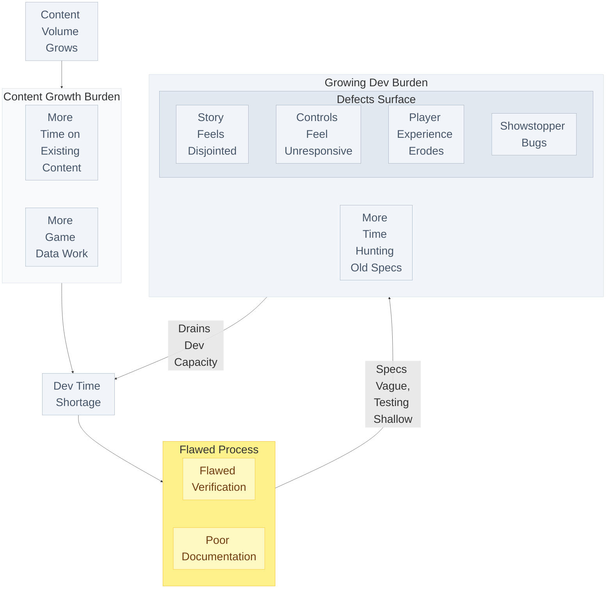
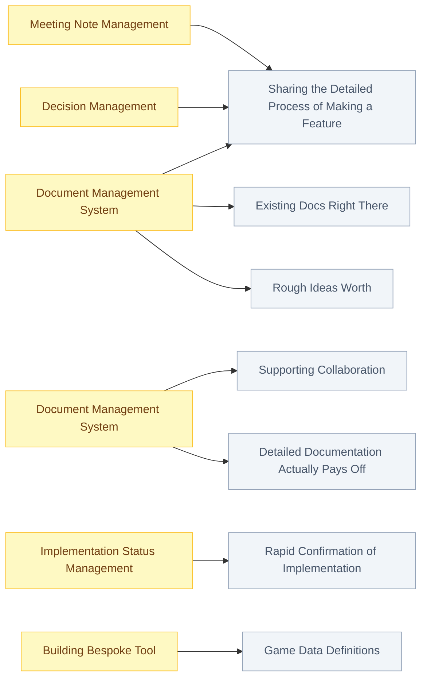
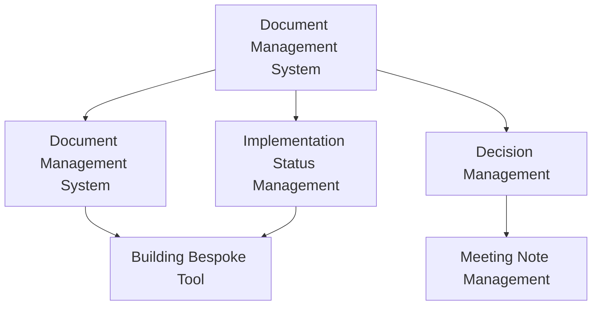

# Summary

- Game development slows down over time.
  - As more content is added, developers spend more time fixing old problems instead of building new features. This creates a cycle that is hard to break.
- Two root causes drive the slowdown.
  - Poor documentation means team members waste time searching for information. Flawed verification means bugs are found late, when they are expensive to fix.
- Simply adding AI makes things worse.
  - AI produces output faster, but if the review process is weak, errors pile up faster too. More output without better process leads to more contradictions, not fewer.
- Better information systems are the real solution.
  - A document management system, a decision log, meeting note tracking, and implementation status monitoring all reduce communication overhead so the whole team can move faster.
- AI works best when the team's knowledge is well-organized.
  - Hallucination is AI's biggest weakness. A team with a solid knowledge system gets much more value from AI than one without. Tools and cooperation together are what drive real progress.

# 1. Introduction

Programmer productivity has improved enormously. Job security has become the go-to topic among programmers these days. [^1] Many big tech companies have been laying off recently. Game companies are too. Many companies are downsizing their manpower[^2] or freezing new hire with AX (AI Transformation).

I noticed a significant boost in my productivity when I build a program with 10K LOCs for 3 months. Defining features took more time than writing code. [^3]

However, can we immediately boost productivity by adopting AI agent in game development? I came across a post arguing that [AX needs a change of the way teams work](https://flowkater.io/posts/2026-03-15-ax-organization-transformation/). Game team needs same organizational change to improve productivity with AI agent.

Let's define what game development goes wrong before discussing organizational change.

# 2. When Game Development Goes Wrong

As game development progresses, the pace generally slows down. Fewer new features get added per milestone. Developers pull all-nighters or push back deadlines as each milestone approaches its end.

The specifics vary by team, but generally the following vicious cycle takes shape.

## The Structure Behind Development Delays

The core reason of cycle is 'Poor Documentation' and 'Flawed Verification', which is colored as yellow.

# 3. Diagnosis

Why does this happen? The first hypothesis is a developer competency issue. But we can find many cases where a team of skilled members still fails. [^4]

Team performance is affected by collaboration more than individual competency. [^5] Why? Individual skill would matter more if tasks can be well-decomposed and each person works independently. But the real situation is not ideal. The book "The Goal"[^6] explains that the competency of the bottleneck determines the competency of the whole organization. In game development teams, there are two representative cases.

## Poor Documentation

There is no time for writing document thoroughly. It doesn't surprise attaching video of existing game and saying "Please implement it as is".

It's not about ability of game designer. There is two structural reasons.

### 1. No incentive to making document

We can reduce implementation time if programmer understands well with good document. But there is no incentive to making document since human can understand by visual easily than text. It's faster that making person understand concept and talking about details with additional conversation than giving just text.

There is no benefit for fellow game designers. A feature is made by one game designer in many team. Multiple workers make development slower since sharing and communication cost go higher.

### 2. No incentive to updating document

It's highly likely that difference between initial document and final implementation. There is some methods to update document. Reading code is not available due to security issue. Playing game to confirm takes a lot of time. Asking to programmer is easiest since they know implementation. That makes benefit from updating document void. Programmer will be "living document" of implementation.

Updating document can't be passed to fellow designer. Every game designers have to put their time to make new feature. There is no document since we discussed in above, transferring context is very hard and takes a long time. Designed person is only available to check thoroughly.

## Flawed Verification

Why we are talking about verification? Is the verification business of QA team?

Generally, QA team verifies a game in last phase of game development. There is a lot of trial to verify in the middle of development. And it's failed since argument that we can't test incomplete feature and misunderstanding that verification makes implementation speed slower.

Why verification takes a log time? There are some reasons, but central thing is that development team doesn't verify a feature after they implement. This thing has a structural problem as well.

Unlike general software, the features of a game are interconnected under the sole goal of "Good Playing Experience". Existing well-working function can make an error after adding or modifying a function. In fact, it might treat a feature that was considered fine as an error.

Another reason is data. Game data is crucial for validation since game is not working with logic only. But realistically, making sound game data during development is difficult when time is needed to develop new features.

In software, catching bugs early costs less — this is well known.[^7] Verifying that the implementation matches the design intent is no different. A fast, solid verification process makes game development significantly faster.

# 4. Solving the Problem

Does adopting AI agent make game development faster? Will this problems be resolved eventually if performance of individual improves?

## Pitfalls of AI Adoption

AI processes task fast. It produces a large volume of output in a short time. It means that the amount of output to review by another person will be increased. 

One natural idea is to automate the review process using AI subagents, which have been growing in popularity. But this approach is unlikely to work, for two reasons.

First, it is hard to define what actually needs to be checked. What does "good enough to skip human review" even look like? Does passing a checklist mean the work is ready to move on? Given how LLMs work, there are no clear answers to these questions.

Second, weak human review leads to weak AI review. AI agents amplify everything — so a flawed review process produces more flaws, not fewer. Real problems get missed, and things that are fine get flagged as problems.

When output is fast but fixes are hard, contradictions pile up across the content — and they pile up fast. You fall into a vicious cycle sooner than you think.

## Guiding Policies

Easy access to game development information helps break the vicious cycle quickly. Lower communication overhead means more time for implementation and a steady development pace, even as the game grows.

### Sharing the Detailed Process of Making a Feature

A single feature can involve many different ideas. Details can change during development. Recording and tracking initial ideas, mid-development discussions, and decisions makes it much easier for the team to find information later. In the past, PM or manager spent a lot of time managing and keeping track of information. Building an information management system could save the game team a lot of that overhead.

### Supporting Collaboration

An information management system can easily gather and organize multiple ideas about the same feature from many people. Before the system, one person had to collect everything - and that took a lot of effort. With the system, you can significantly reduce the overhead of gathering ideas and decisions. That means multiple workers can collaborate on a single feature. And since all context is tracked, anyone can step in and continue a feature when the original developer is out. Of course, one person in charge still needs to decide which idea to adopt and how. But lower communication overhead means you can break a work into smaller pieces and distribute them to colleagues.

### Rapid Confirmation of Implementation

You can quickly check whether a feature with finalized spec decisions has been implemented. Once it is, you can test it against the spec right away. A clear spec also lets you generate test data from boundary values. That means you can run tests earlier — and earlier testing cuts the cost of fixing bugs significantly.

### Additional Benefits

You can get additional benefits like this:

- You can build a structure where detailed documentation actually pays off.
- Existing docs are right there when a new idea comes up.
- Even rough ideas are worth writing down — the system rewards it.
- Design documents double as implementation specs for game data definitions.

# Implementation List

These implementations are needed to overcome challenge above.

## Dependency Diagram

Implementations have dependencies like:

I will cover the implementation details and operational strategy for each system in a separate post. 

## Document Management System
This system has two goals.

The first is simple: write a document anywhere, and it becomes searchable. You can pull up all documents for a feature in one place, sorted by time, and search for related ideas while you write.

The second is to manage relationships between documents. It means that marking which ideas are connected and improving search quality. The system can help, but deciding what a document means and how it connects to others is always a human call. Still, those relationships do pay off. They're what makes search better.

See [*Adoption of Document Management System*](/en/2026/05/03/dms-ptbmaf/) for a detailed proposal of how this system could be built.

## Game Design Review System

Once the document management system makes existing docs searchable, you can use an LLM to check new design documents for contradictions or ambiguities with existing ones. The final review is still a human's job. But before it gets there, the author can use an LLM to improve readability and shrink the scope of what needs reviewing. In this system, the LLM checks fixed rules and format; humans judge the value of the content.

## Meeting Note Management

This system can transcribe internal chats, remote meetings, and in-room discussions and add them directly to the document management system. That turns every conversation into searchable reference material. No separate design doc is required.

## Decision Management

With this system, you can log every decision about a feature's direction or details, which is who made the call and why. You can start with plain text files and can switch formats later as needed.

## Implementation Status Management

An LLM agent periodically reads through all the code and logs the current implementation status in the document management system. You can then compare that against the design docs and see how far implementation has come.

## Building Bespoke Tool for Game Designer

The biggest advantage of Agentic coding is that you can build custom tools tailored to each worker's needs. With the document management system and game data management system as a reliable central core, and you can combine design docs with each worker's requirements to build tools that maximize their productivity.

# Conclusion

Two things gave humans their evolutionary edge: tools and cooperation. AI is a great tool for amplifying what individuals can do — but it's also a way to improve how an entire development team works together.

AI's most critical limitation is inconsistency — hallucination is the clearest example. A team with a solid knowledge system gets dramatically more out of AI than one without. The knowledge management system described in this post is meant to help with exactly that.

I'd love to hear from anyone who's interested. I'd be grateful for any chance to discuss and come away with a broader perspective.

[^1]: [Measuring the Impact of Early-2025 AI on Experienced Open-Source Developer Productivity (METR, 2026)](https://metr.org/blog/2026-02-24-uplift-update/), [Which AI Coding Tools Do Developers Actually Use at Work? (JetBrains, 2026)](https://blog.jetbrains.com/research/2026/04/which-ai-coding-tools-do-developers-actually-use-at-work/)
[^2]: [Layoffs dashboard in Gaming Company](https://gaminglayoffs.com/)
[^3]: I will write a post to describe it.
[^4]: [The case of NBA superteam](https://www.espn.com/nba/story/_/id/27462338/what-did-just-watch-bronze-broke-usa-basketball)
[^5]: [Team performance study by Google](https://psychsafety.com/googles-project-aristotle/)
[^6]: [The Goal](https://www.amazon.com/Goal-Process-Ongoing-Improvement/dp/0884271951)
[^7]: [Code Complete, 2nd Edition (Steve McConnell, 2004)](https://dl.acm.org/doi/10.5555/1096143), [Software Engineering Economics (Barry W. Boehm, 1981)](https://www.semanticscholar.org/paper/Software-Engineering-Economics-Boehm/72910077a29caf411dbb03148997c72b47e65ab0)
