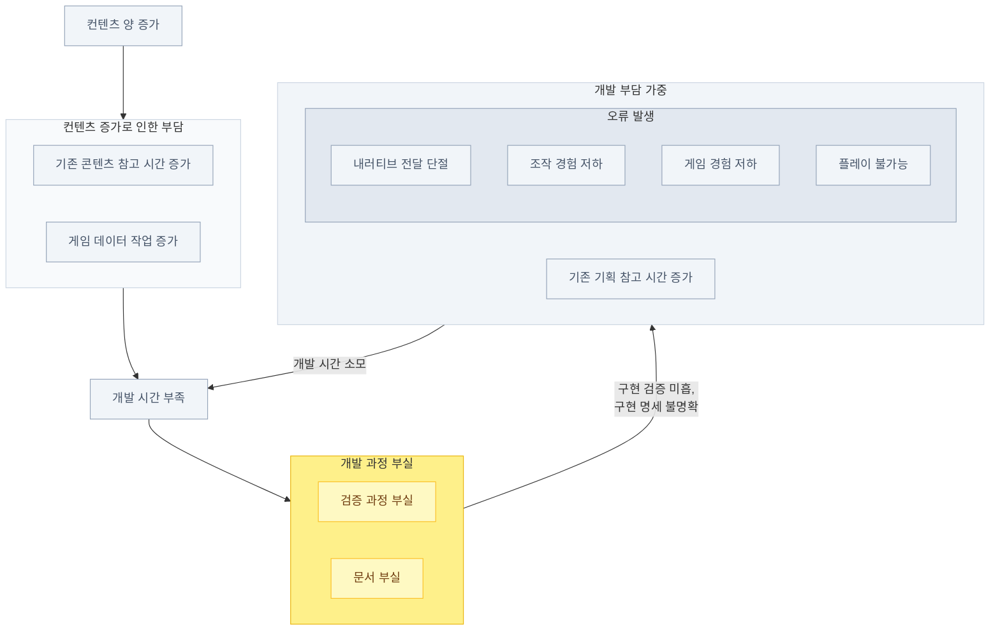
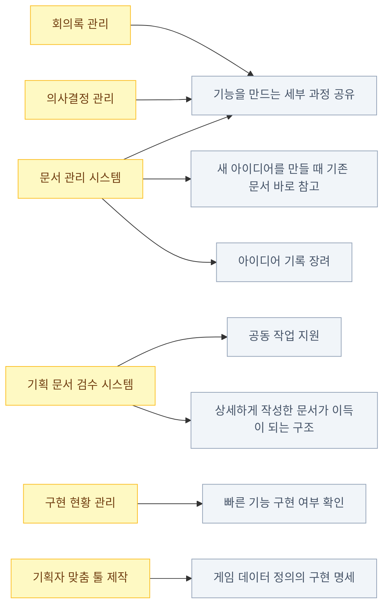
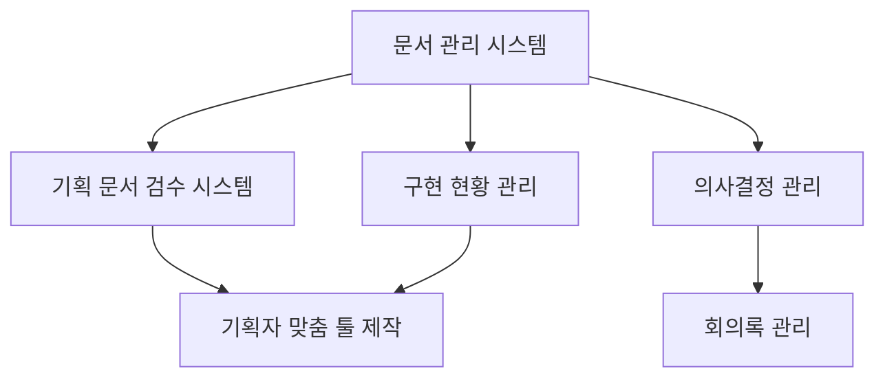

# 전체 요약

- 게임 개발은 진행될수록 속도가 느려진다.
  - 컨텐츠가 늘어날수록 기존 내용을 수정하는 데 시간이 더 많이 들고, 새 기능을 추가할 여유가 줄어드는 악순환이 만들어진다.
- 핵심 원인은 개인 역량이 아닌 구조적 문제다.
  - '문서 부실'과 '검증 과정 부실'이 악순환의 핵심이며, 실력 좋은 팀도 이 구조적 문제 앞에서는 속도가 느려진다.
- 문서를 작성하거나 업데이트할 유인이 없다.
  - 글보다 대화가 빠르고, 구현이 바뀌어도 문서를 고칠 방법이 마땅치 않다. 결국 프로그래머가 '살아있는 문서'가 된다.
- AI를 단순 도입하면 악순환이 더 빨라진다.
  - AI는 결과물을 빠르게 만들지만, 검토 과정이 부실하면 결함도 그만큼 빠르게 쌓인다. AI 서브에이전트로 검토를 자동화하는 것도 근본적인 해결책이 되기 어렵다.
- 해결책은 팀 전체의 정보 접근성을 높이는 시스템이다.
  - 문서 관리, 회의록 관리, 의사결정 기록, 구현 현황 관리 시스템을 갖추면 커뮤니케이션 비용이 줄고, 게임이 커져도 개발 속도를 유지할 수 있다.

# 1. 들어가며

AI가 코드를 자율적으로 작성하는 방식인 Agentic coding으로 인해 프로그래머의 생산성이 엄청나게 증가했다.[^1] 요즘 프로그래머들과의 대화 주제가 직업 안정성일 정도이다. 실제로 많은 해외 빅테크 기업에서는 인력 구조조정을 진행하고 있다. 게임업계도 예외는 아니다. 주요 기업들은 AX(AI Transformation)을 진행하면서 인력을 축소하거나 [^2] 새 인력을 뽑지 않고 있다.

개인적으로 약 10만 줄 분량의 코드로 이루어진 프로그램을 3개월간 만들었을 때, 생산성이 매우 증가했음을 느꼈다. 코딩이 아니라 내가 기능을 정의하는 시간이 더 걸릴 지경이었다. [^3]

그러나 게임 개발에 AI Agent를 도입하면 생산성을 바로 향상시킬 수 있을까? 마침 비슷한 생각을 하는 글을 발견했다. [AX에는 조직 자체의 변화가 필요하다는 글](https://flowkater.io/posts/2026-03-15-ax-organization-transformation/)이었다. 게임 개발 조직에 AI agent를 도입해서 생산성을 높이려면 마찬가지로 조직 관점의 변화가 필요하다.

변화에 대해 이야기하기 전에, 먼저 게임 개발이 잘 안 된다는 것이 어떤 것인지부터 정의해 보자.

# 2. 게임 개발이 잘 안 된다?

보편적으로 게임 개발이 진척될수록 진행 속도가 느려진다. 마일스톤에 새로 추가하는 기능은 적어지고, 개발진들은 마일스톤이 끝나가는 시점에 밤샘근무를 하거나 마일스톤 종료일을 미룬다.

세부 사항은 개발팀마다 차이가 있지만, 대체적으로 다음과 같은 악순환이 만들어진다.

## 개발 진행 지연 구조

이 중 노란색으로 표시된 '문서 부실'과 '검증 과정 부실'이 악순환의 핵심 원인이다.

# 3. 원인 분석

왜 이런 일이 발생할까? 가장 먼저 생각할 수 있는 가설은 개발진의 역량 문제라는 것이다. 그러나 실력이 좋은 구성원이 모인 집단이 실패한 사례를 많은 곳에서 찾아볼 수 있다.[^4]

팀의 퍼포먼스 차이는 각 구성원의 개별 능력보다 협업 정도에 더 많은 영향을 받는다.[^5] 왜 그럴까? 일을 잘 분해해서 같이 일하지 않고 각자 일할 수 있다면 개인의 실력이 중요하겠지만, 실제 상황은 이상적이지 않기 때문이다.
책 The Goal[^6]에서는 병목이 발생하는 지점의 역량이 전체 조직의 역량을 결정한다고 설명한다. 게임 개발팀에서는 다음 두 가지가 있다.

## 문서 부실

문서를 꼼꼼하게 쓰기에는 시간이 부족하다. 프로그래머가 이해하도록 하기 위해, 이미 존재하는 게임의 동영상을 첨부하고 "그대로 구현해주세요" 라고 말하는 것은 놀랍지 않다.

기획자의 역량 부족이라고 할 수는 없다. 두 가지 구조적인 이유가 있다.

### 1. 문서 작성 자체에 이득이 없다

문서를 잘 작성해서 프로그래머가 잘 이해한다면 구현 시간을 줄일 수 있다. 하지만 사람은 글보다는 그림으로 더 잘 이해하기 때문에, 문서를 글로 작성하는 것은 이득이 없다. 우선 컨셉을 이해시키고, 세부사항은 채팅이나 대화로 이야기하는 것이 훨씬 빠르다.

동료 기획자에게 상황을 공유하기 위한 문서 작성도 이득이 없다. 많은 게임 팀에서 세부 기획을 한 사람에게 맡기기 때문이다. 여러 사람이 같이 일하게 되면 아이디어나 생각을 공유하기 어렵고, 의사소통 비용이 높아져 오히려 한 사람이 담당하는 것보다 속도가 느려진다.

### 2. 문서를 업데이트하는 이득이 없다

처음 만들었던 문서와 최종 구현은 달라질 수밖에 없다. 기획 문서를 업데이트하기 위한 방법을 몇 가지 생각해보자. 코드를 직접 보는 것은 보안 등의 이유 때문에 불가능하다. 게임 플레이로 구현을 측정하려면 시간이 많이 들어간다. 때문에 기획 문서를 업데이트하는 것보다 필요할 때 프로그래머에게 물어보는 것이 더 낫다. 프로그래머가 일종의 최신 구현 문서가 된다.

다른 사람에게 맡길 수도 없다. 다른 기획자도 새로 들어갈 기능에 시간을 써야 하는 것은 마찬가지다. 앞서 1번에서 설명한 이유로, 기획을 할 때 문서 작성을 하지 않았기 때문에 맥락을 넘기기도 힘들고 시간이 많이 걸린다. 기획한 본인이 확인해야만 제대로 확인할 수 있다.

## 검증 과정 부실

구현 검증은 QA가 하는 것이 아닌가? 왜 개발 지연에 대해 이야기하는데 구현 검증을 이야기하는 것일까?

일반적인 경우, QA 부서는 게임 개발 과정의 최후반부에서 검증을 실행한다. 게임 개발 중에 검증을 하는 시도가 없는 것은 아니다. 아직 완성되지 않은 기능을 테스트할 수는 없다는 주장과, QA 부서의 검증이 전체 개발 속도를 늦춘다는 오해 때문에 시도가 좌절될 뿐이다.

그렇다면 왜 QA 부서가 검증을 하는 데에 오래 걸리는가? 여러 가지 이유가 있지만, 핵심적인 이유는 개발 팀에서 만들어진 기능에 대한 검증을 하지 않기 때문이다. 역시 여기에도 구조적인 문제가 있다.

일반 소프트웨어와 달리, 게임의 기능은 '좋은 플레이'라는 하나의 목표 아래 서로 긴밀하게 연결되어 있다. 한 개의 기능을 추가하거나 변경했을 때 기존에 잘 작동했던 기능이 오류를 일으키거나, 심지어는 정상적으로 작동하는 것 자체가 오류가 될 수 있다.

또한 게임 기능은 로직만큼이나 데이터가 중요한데, 새 기능 개발로 시간이 부족한 상황에서 데이터를 완전히 채우기는 현실적으로 어렵다.

오류를 빠르게 발견할수록 비용이 작다는 사실은 소프트웨어 업계의 상식이다.[^7] 기획 의도를 만족했는지 구현 완료 시점에 확인해두는 일도 마찬가지다. 검증 과정이 빠르고 탄탄할수록 게임 개발 속도가 훨씬 빨라질 것이다.

# 4. 문제 해결

AI agent를 도입하면 게임 개발을 더 빠르게 진행할 수 있을까? 개인의 생산성이 높아지면 이 문제들을 어떻게든 해결할 수 있지 않을까?

## AI 단순 도입의 함정

AI는 빠르게, 많이 만들어낸다. 팀 작업에서 결과물은 검토를 거쳐야 다음 단계로 넘어간다. 양이 적을 때는 사람이 충분히 감당할 수 있다. 많아질수록 따라가기 어려워진다.

최근에 인기를 얻고 있는 AI 서브에이전트를 이용하여 검토를 자동화하자고 생각해볼 수 있다. 그러나 이 방법은 두 가지 이유 때문에 통하지 않을 가능성이 높다.

첫 번째로 어떤 것을 검사해야 하는지 정하기 어렵다. 사람이 검사할 필요가 없을 정도는 대체 어떤 것인가? 체크리스트를 모두 만족하면 다음 단계로 넘어갈 수 있을까? LLM의 특성상 이 질문에 명확한 답을 내리기 어렵다.

두 번째는 개인 수준의 결과물 검토가 부실할 경우 결과물에 대한 AI의 검토도 부실해진다는 점이다. AI agent는 모든 것을 증폭하기 때문에 검토에 결함이 있을 경우 더 많은 결함이 만들어진다. 고쳐야 할 결함을 지나칠 뿐만 아니라, 고치면 안 되는 부분을 결함으로 판정할 수도 있다.

이렇게 결과물이 빠르게 나오는데 결함을 수정하기 힘들면 콘텐츠 간 모순이 더 빠르게 쌓인다. 악순환에 더 빠르게 빠져드는 셈이다.

## 어떻게 하면 되는가?

악순환 문제를 빠르게 해결하려면 게임 개발 정보를 쉽게 접근할 수 있도록 해야 한다. 의사소통 비용을 줄여야 기능 구현 시간을 확보할 수 있고, 게임의 크기가 커져도 개발 속도를 유지할 수 있다.

### 기능을 만드는 세부 과정 공유

한 가지의 기능을 만드는 데에 여러 아이디어가 들어갈 수 있다. 또한 개발 중에 기능의 세부사항을 변경할 수도 있다. 초기 아이디어, 중간 논의사항, 의사결정 등을 기록하여 추적할 경우 팀의 정보 참조 능력이 크게 올라가게 된다. 기존에는 PM 또는 팀장들이 정보를 관리하고 파악하는 데에 많은 시간을 들였다. 게임 팀에서 정보 관리 시스템을 만들어서 관리한다면 이 비용을 많이 절약할 수 있다.

### 공동 작업 지원

정보 관리 시스템은 여러 사람이 같은 기능에 대한 아이디어를 내더라도 쉽게 모아서 정리할 수 있다. 기존에는 한 사람이 취합하는 비용이 많이 들었다. 시스템이 있다면 아이디어와 의사결정을 취합하는 비용을 크게 줄일 수 있다. 여러 작업자가 한 개의 기능을 작업할 수 있게 된다. 또한 맥락을 모두 관리하기 때문에 특정 기능을 만든 작업자가 자리를 비웠을 때 다른 사람이 작업을 쉽게 이어받을 수 있다. 물론 책임자 한 명이 어떤 아이디어를 어떻게 적용할 지 의사결정이 필요하다. 하지만 커뮤니케이션 비용이 줄어들기 때문에 작업을 더 작은 단위로 쪼개서 많은 사람들에게 나누어 줄 수 있다.

### 빠른 기능 구현 여부 확인

명세 의사결정이 완료된 기능이 구현되어 있는지 빠르게 판단할 수 있다. 구현되어 있다면 명세에 맞게 동작하는지 테스트할 수 있다. 명확한 명세가 있으면 테스트 데이터도 경계값을 기준으로 생성할 수 있다. 이를 통해 테스트를 더 일찍 진행해볼 수 있어서 오류 수정 비용을 매우 줄일 수 있다.

### 구체적으로 얻게 되는 다른 이득들

이외에도 아래와 같은 이득을 얻을 수 있다.

- 상세하게 작성한 문서가 이득이 되는 구조를 만들 수 있다
- 새 아이디어를 만들 때 기존 문서를 바로 참고할 수 있다
- 완벽하게 준비된 아이디어가 아니더라도 기록하는 것이 나은 구조가 된다
- 기획 문서가 게임 데이터 정의의 구현 명세 중 하나가 된다

# 필요 구현 목록

문제를 풀기 위해서는 다음과 같은 구현이 필요하다.

## 구현 의존도

구현들은 다음과 같은 의존성을 가진다.

각 시스템의 자세한 구현 및 운용 전략은 별도의 글로 작성할 예정이다.

## 문서 관리 시스템

이 시스템의 목표는 두 가지이다.

첫 번째는 문서를 어딘가에 기록해 두기만 하면 검색이 잘 되는 시스템을 마련하는 것이다. 각 기능 관련 문서를 모두 모아서 시간 순서대로 볼 수 있게 된다. 문서를 작성하는 도중에 연관된 아이디어가 있는지 검색할 수 있게 된다.

두 번째로는 문서 간의 관계를 관리하여 어떤 아이디어들이 서로 연결되어 있는지 표시하고 검색 품질을 향상시키는 것이다. 시스템이 지원하더라도 문서의 의미와 관계를 결정하는 것은 사람일 수 밖에 없다. 하지만 설정한 관계를 토대로 검색 품질을 높일 수 있다.

## 기획 문서 검수 시스템

문서 관리 시스템으로 인해 기존에 구현된 기능에 대한 문서 검색이 가능해질 경우, LLM을 이용해 새 기획 문서와 기존 기획 문서 간의 모순점 또는 애매한 점을 검수하는 기능을 만들 수 있다. 최종적인 검수는 사람이 수행해야겠지만, 적어도 그 전에 작성자가 LLM의 도움을 받아 문서의 가독성을 높이고 사람이 검수할 범위를 크게 줄일 수 있다. 이 시스템에서 LLM은 고정적인 원칙과 형식을 검사하는 역할이고, 사람은 콘텐츠의 가치를 검수하는 역할이다.

## 회의록 관리

이 시스템을 통해 사내 메신저 채팅이나 원격 회의, 회의실 회의 등을 텍스트로 변환하여 문서 관리 시스템에 삽입할 수 있다. 이를 통해 기획 문서를 따로 정리하지 않더라도 검색이나 문서 작성 시 참조할 수 있는 구조를 만들 수 있다.

## 의사결정 관리

기능의 방향성이나 세부 사항을 정할 때, 누가 어떤 이유로 결정을 했는지 기록하게 할 수 있다. 처음에는 단순한 텍스트 파일로 시작하고, 필요에 따라 저장 형식을 변경할 수 있다.

## 구현 현황 관리

LLM agent가 일정 주기마다 코드를 모두 읽고 문서 관리 시스템에 현재까지 구현되어 있는 기획 현황을 정리한다. 기획 문서와 현황을 비교하여 구현 정도를 바로 알 수 있다.

## 기획자 맞춤 툴 제작

Agentic coding의 가장 큰 장점은 각 작업자의 요구사항에 맞는 맞춤 프로그램을 만들 수 있다는 것이다. 문서 관리 시스템과 게임 데이터 관리 시스템을 중앙에 안정적으로 구축한다면, 기획 문서와 작업자의 요구사항을 조합하여 최대 작업 효율을 내는 툴을 만들 수 있다.

# 결론

사람이 진화적 우위를 차지할 수 있었던 비결 중 하나는 도구의 사용이고, 다른 하나는 협력이다. AI는 개인의 능력을 증폭시켜주는 좋은 도구이지만, 동시에 개발 팀 전체의 협력을 개선할 수 있는 매개이기도 하다.

AI의 한계 중 가장 치명적인 부분은 환각(Hallucination)으로 대표되는 일관성 부족이다. 안정적인 지식 체계를 갖추는 팀과 아닌 팀의 AI로 인한 생산성 향상에는 큰 차이가 있다. 이 글에서 제시한 지식 관리 시스템이 도움이 될 것이다.

관심 있는 분들의 연락을 기다리고 있다. 이 글에 동의하셔도 좋고 아니어도 좋다. 논의하면서 서로의 생각을 넓힐 수 있는 기회가 주어진다면 감사하겠다.

[^1]: [Measuring the Impact of Early-2025 AI on Experienced Open-Source Developer Productivity (METR, 2026)](https://metr.org/blog/2026-02-24-uplift-update/), [Which AI Coding Tools Do Developers Actually Use at Work? (JetBrains, 2026)](https://blog.jetbrains.com/research/2026/04/which-ai-coding-tools-do-developers-actually-use-at-work/)
[^2]: [미국 기업 layoff](https://gaminglayoffs.com/)
[^3]: 관련해서 글을 하나 작성할 예정이다.
[^4]: [NBA Superteam 사례](https://www.espn.com/nba/story/_/id/27462338/what-did-just-watch-bronze-broke-usa-basketball)
[^5]: [Google의 팀 퍼포먼스 연구](https://psychsafety.com/googles-project-aristotle/)
[^6]: [책 The Goal](https://product.kyobobook.co.kr/detail/S000001758869)
[^7]: [Code Complete, 2nd Edition (Steve McConnell, 2004)](https://dl.acm.org/doi/10.5555/1096143), [Software Engineering Economics (Barry W. Boehm, 1981)](https://www.semanticscholar.org/paper/Software-Engineering-Economics-Boehm/72910077a29caf411dbb03148997c72b47e65ab0)
