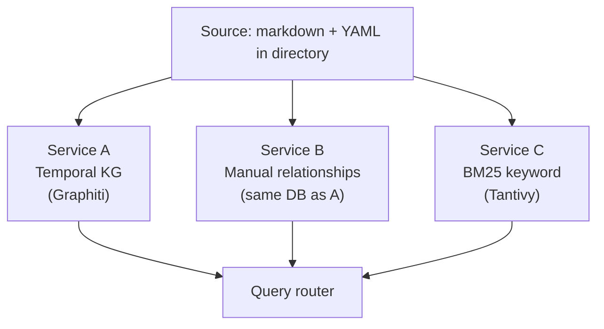

# Adoption of Document Management System

This document proposes the adoption of a document management system (DMS) designed for game-development teams. 

---

## 1. Problem Statement

> What are we trying to solve? What are the root causes?

Experienced game teams deliberately assign one feature to one worker, with one document as its record. They adopt this practice on purpose. When many people share responsibility for one feature, the feature drifts, decisions get reopened, and the team spends more time on design debates than on building. Single ownership keeps the design coherent and makes the source of truth obvious. The assigned worker is the source of truth for the current state, and the file holds the feature's history. The practice has been the standard for many teams.

The same practice has a backfire. Single ownership is enforced by keeping each feature in one head and one file, so the connections between features live nowhere except in the workers' coordination. When the team is small and the feature set is short, the workers can hold those connections in mind. As the team and the corpus grow, the connections become too many to track that way. A change to a feature still has to ripple to the others, but no system carries the ripple. The workers carry it, in meetings and chat threads. The result is stale dependencies, hidden contradictions, and decisions that no one can confidently reconstruct.

### Two recurring tasks where the cost shows up

The backfire is felt most clearly in two recurring tasks.

The hardest task is keeping track of the current state of approved details. To answer "what is the damage formula now?", someone finds the most recent doc that mentions it and hopes nothing else contradicts it. Each new decision raises the cost of this check.

Next is tracking relationships between features. To answer "if we adjust this skill, which items become obsolete? Which monsters' stats need re-tuning?", someone relies on memory or a stale wiki page. A change in one feature does not automatically surface its effect on details elsewhere.

Every game team faces this work. No widely-used tool makes it easy.

### Three root causes

There are three root causes behind these problems.

First, documents pile up over time without a clear rule for which one wins. New decisions do not formally cancel old ones, and the reader has to know that the latest document is the correct one.

Second, the same detail is referenced by many features. The damage formula touches combat, items that grant bonuses, and monsters tuned against it. A change to the detail in one feature ripples to the others, and tracking that ripple by hand is hard.

Third, the hard work is at the detail level, not the document level. People do connect related documents — they cite earlier designs and link to dependent ones. The breakdown is finer: extracting the individual facts buried in prose, tracking how each fact changed across many documents over time, and capturing why each change was made. Today this work happens whenever someone asks a question, and they have to redo it from scratch each time.

### What this proposal changes

In one sentence: across a multi-feature, multi-author document set, the team needs version control at the level of individual facts inside each document.

This proposal reduces the backfire. The connections between features, and the history of each fact inside a feature, move out of the workers' heads and into a queryable artifact. Communication and synchronization cost drops with them. Multiple workers can then share a feature, which the original best practice could not safely allow.

---

## 2. Solution

> What is the proposed solution?

The proposed solution is a three-service stack with a modular architecture. One shared set of source documents is read by separate services. Each service has its own ingestion and storage. A thin router maps user queries to the right service. A read-only MCP wrapper for AI agents is added in a later phase.

### How the daily work changes

Four parts of a designer's day change after adoption.

History lookup takes one query. Without the system, a designer asking "how did the damage formula evolve?" searches through past design docs that mention it, reads them in order, and reconstructs the answer by hand. With the system, the same question returns a timeline. Each fact has a date and a citation to its source document.

Adding a new document becomes a structured exchange with the system. The designer writes the document. The system proposes a decomposition: which feature details changed, which earlier facts are now out of date. The designer accepts what is right and corrects what is wrong. The team's knowledge graph updates in one step. The document is part of a queryable artifact from the moment it is committed.

The team stops tracking facts by hand. The system carries the per-feature current-state pages, the change history, and the dependency lists that designers used to keep in their heads. The designer's time goes to the design itself.

Multiple designers can contribute to the same feature concurrently. The communication and synchronization cost that the original best practice avoided is now absorbed by the system. Each designer writes a document, and the system aggregates the facts across them. When two facts conflict, the system surfaces the contradiction for the designers to resolve.

### Two user roles

The system has two user roles.

Humans write everything. They ingest documents, edit frontmatter, and curate manual relationships. They also read everything. Their auth scope is `human`.

AI agents read only. They cannot author documents or relationships. Their auth scope is `agent`, and they receive token-budget-aware results with citations on every fact.

The query router enforces this by checking the token scope before any service is called. Write endpoints return 403 to agent tokens. The reasoning is simple: hallucinated writes from an LLM would corrupt the canonical source, so humans remain the only writers.

The architecture looks like this:

Each service has a clear role.

- Service A — Temporal-KG
  - Role: feature history, current state, and AI-derived relationships between features.
  - Tech: Graphiti + Neo4j.
- Service B — Manual relationships
  - Role: human-curated relationships between features, with provenance.
  - Tech: same Neo4j as Service A, distinguished by a `source: manual` flag.
- Service C — BM25 keyword
  - Role: fast keyword retrieval and the backup when Service A is degraded.
  - Tech: Tantivy or Whoosh, with mecab-ko or a similar tokenizer for the team's language.
- Query router
  - Role: the single entry point. Maps query type to services, enforces token scopes, applies cross-service filters, and handles fallback when a service is degraded.
  - Tech: Flask or FastAPI.
- MCP server (later phase)
  - Role: a read-only adapter that exposes router endpoints as agent tools (`feature_history`, `feature_current`, `feature_related`, `search_keyword`, `feature_list`, and others).
  - Calls the router internally with an `agent`-scoped token.
  - Tech: Python MCP SDK.

### Editor connector

The DMS does not ship one connector. The connector is what the designer's editor uses to talk to the system. On the way in, it detects new or changed documents, validates frontmatter locally, and calls the ingest webhook. On the way back, it fetches the proposals the system extracts, presents each one to the designer for review, and sends the designer's accept, edit, or reject decision for that one detail back to the system. Each adopting team builds their own connector. Two reasons. First, this is typical glue code (watch a directory, parse YAML, call an HTTP endpoint, open a browser tab) that agentic coding handles well. A team with one engineer and an AI-assisted editor can ship a working connector in a day or two. Second, each team's setup differs too much for a single shipped connector to fit. Editors range from VS Code and Obsidian to plain text editors; workflows range from "save and publish" to "git push triggers it"; source control ranges from git to shared drives. A shipped connector would either force every team into one workflow or be so configurable that it becomes the same scaffolding the team would write anyway.

The DMS provides the stable contract the connector calls:

- Canonical source location: a directory path the team configures.
- Frontmatter schema: the validated `feature_id` and other required fields, published as a JSON schema file.
- Ingest endpoint: `PATCH /docs/{id}` with the document body, returning the set of extracted proposals.
- Proposal-review endpoints. Each proposal is one detail unit (a feature-attribute pair, a relation triple, or a timestamped fact); the designer decides on each one independently:
  - `GET /docs/{id}/proposals` — fetch the proposals waiting on the designer.
  - `POST /docs/{id}/proposals/{pid}/accept` — accept as proposed.
  - `PATCH /docs/{id}/proposals/{pid}` — accept with an edited value.
  - `POST /docs/{id}/proposals/{pid}/reject` — reject (one-line reason required).
- Auth: a `human`-scoped token issued per author.

Start with a CLI. It is the simplest connector to build — agentic coding scaffolds the whole thing in a day — and it is enough to put the system in designers' hands during Phase 0. Editor plugins and richer workflows come later if the team needs them. Building the CLI connector is a Phase 0 deliverable for the adopting team, alongside standing up the canonical source and Service C.

### Ingestion: what happens when a designer adds a document

The ingest path keeps hallucinated facts out of the knowledge graph. Humans remain the only writers. The LLM proposes the decomposition, and the designer commits.

There are five steps.

The first step is parse and validate frontmatter. The system reads the YAML frontmatter and checks that the `feature_id` exists in `features_catalog.yaml`. If the validation fails, the designer fixes the frontmatter before the document moves forward.

The second step is propose decomposition. An LLM reads the document and proposes a set of detail units: feature-attribute pairs (for example, `combat-system.damage_formula = "2*STR + WPN"`), entity-relation triples (for example, combat-system depends-on stats-system), and timestamped facts (for example, effective-from = the date in the document). Each proposal carries a confidence score.

The third step is tier the proposals. High-confidence proposals — frontmatter fields, headings, structured tables, fields with explicit names — are auto-accepted. Low-confidence proposals — free-prose facts, inferred relationships, anything not directly quoted from a structured field — are queued for human review.

The fourth step is review by the designer. The connector fetches the queued proposals via the proposal-review endpoints, presents them to the designer alongside the source text that produced them, and captures the designer's accept, edit, or reject decisions. A rejection requires a one-line reason, which feeds back into prompt tuning over time.

The fifth step is commit. Accepted proposals are written to Service A with `source: ai-extracted` and a timestamp. The original document is indexed by Service C for keyword retrieval. The designer can add manual relationships to Service B at any point after.

A flat approve-everything gate would create a queue that designers rubber-stamp under deadline pressure. Auto-accepting only the structured parts of the document, like frontmatter and headings, keeps the designer's attention on the LLM's interpretations of free prose, where errors are most likely. The proposal rejection rate, tracked in Section 5, tells the team whether the tiering is set right.

### Read path: routing

The router decides routing based on the endpoint URL, not by parsing the meaning of the query. Each query type has a primary service and a backup for when the primary is degraded.

- `GET /feature/{id}/history`
  - Primary: Service A (Graphiti `facts(all_time=true)`).
  - Backup: Service C with `X-Degraded: history-via-text-match`.
- `GET /feature/{id}/current`
  - Primary: Service A (Graphiti `facts(valid_now=true)`).
  - Backup: Service C with `X-Degraded: current-via-text-match`.
- `GET /feature/{id}/related?source=manual|ai|all`
  - Primary: Service A (Cypher with `r.source` filter).
  - No backup; return 503 if A is down.
- `GET /search?q=` (keyword)
  - Primary: Service C (BM25).
  - Backup: Service A's hybrid retrieval with `X-Degraded: keyword-via-graph`.
- `GET /docs/{id}`
  - Primary: canonical source (file read).
  - No backup; 404 if the file is gone.
- `PATCH /docs/{id}`
  - Primary: canonical source (file write + re-ingest webhook).
  - No backup; 503 if write fails.
- `POST /feature/{id}/relationship`
  - Primary: Service A (Cypher INSERT with `source: "manual"`).
  - No backup; 503 if A is down.

The router applies four filters in order, each narrowing the result set:

1. `team_namespace` (server-side) — restricts results to the requesting team's namespace.
2. `exclude_filter` (router-side) — drops documents with `exclude: true` in frontmatter.
3. `feature_id` — narrows to a specific feature when the caller scopes the query.
4. `importance_min` — drops results below a minimum importance score.

Service health checks run every 30 seconds. When a service is degraded, the router falls back automatically.

### Other design decisions

Several other design decisions follow.

- Markdown plus YAML frontmatter is the canonical source. Whether the source is git-managed or stored as plain files does not affect the search layer.
- The `feature_id` is explicit in document frontmatter and is validated against a controlled `features_catalog.yaml`.
- Two-time-axis invalidation keeps history while answering current-state queries cleanly.
- Manual relationships share storage with AI-derived relationships and are distinguished by a `source` property, so human curation needs no extra infrastructure.
- Mem0-g runs in shadow mode for two weeks during Phase 2 as a validated alternative to Service A.
- The router routes from the URL path and follows the routing table. Dynamic fusion, caching, and free-text parsing are out of scope for this iteration.

### Delivery phases

The work is delivered in phases.

- Phase 0 (Days 1–3)
  - Delivers: canonical source, Service C, and a CLI connector.
  - Visible effect: a keyword search query returns the top-5 results in under 200ms. Designers can register a document via the CLI.
- Phase 1 (Weeks 1–2)
  - Delivers: LLM enrichment and frontmatter completion.
  - Visible effect: all documents have `feature_ids`, `tags`, and `summary`. Feature-scoped search works.
- Phase 2 (Weeks 3–4)
  - Delivers: Service A (Graphiti) and the Mem0-g shadow run.
  - Visible effect: a query like "how did the damage formula evolve?" returns a clean timeline.
- Phase 3 (Month 2)
  - Delivers: Service B and governance enforcement.
  - Visible effect: the team can curate "feature A depends on feature B". Queries return both manual and AI relationships with source labels.
- Phase 4 (Month 3, optional)
  - Delivers: Service D (per-feature LLM summary).
  - Visible effect: human-readable per-feature pages.
- Phase 5 (later, open-ended)
  - Delivers: the MCP server for agents, Service E (RAPTOR), language tuning, and feedback learning.
  - Triggered by agent adoption or usage signals.

---

## 3. Tradeoffs

> What is the underlying tension we have to break?

### The core tension

The main tension is between scale and richness. On one side, the Karpathy LLM-wiki approach keeps a per-feature page that an LLM updates over time. The retrieval quality is excellent at around a hundred sources, but the approach falls apart beyond that. On the other side, normal RAG indexes raw chunks of text and scales to millions of documents, but it never builds knowledge. Every query rederives the answer, and there is no time model.

The right answer is something between these two. Game teams need a structured, queryable artifact that grows over time and still scales without rebuilding the answer for every query.

### Design choices

Several smaller tensions follow from this design.

- One bundled system or many services — pick many services.
  - A bundled system is simpler at first but ties the team to one vendor's ideas.
  - With many services, each one can be replaced on its own.
- AI-derived relationships or human-curated relationships — pick both.
  - AI scales but is noisy.
  - Humans are precise but slow.
  - Run both, let humans correct the AI, and tag the source on every relationship.
- Two-time-axis facts or append-only facts — pick two-time-axis. Old facts are marked as no longer valid, not deleted.
  - A two-time-axis fact carries two dates. One is when the fact takes effect in the real world (valid time). The other is when the system records it (transaction time). The two can differ. A change documented on March 5 may only take effect on April 1, when the next sprint starts.
  - Append-only loses the idea of a current state.
  - Replace-on-update loses history.
  - The two-axis model keeps both, at a storage cost most teams can pay.
- Build or buy — build on open source (Graphiti).
  - Buying the managed Zep service is expensive and proprietary.
  - Graphiti, the open-source engine inside Zep, gives the same capability at the team's own infrastructure cost.
  - A team can switch to Zep later if managed support becomes worth paying for.
- Separate manual-relationship service or shared store — pick a shared store with a source flag.
  - A separate database for manual relationships doubles the operations work for a small dataset.
  - Storing manual relationships in Service A's graph with a `source: manual` property is auditable and uses no extra infrastructure.
- Strict latest-wins or invalidate-with-history — pick invalidate-with-history.
  - Strict replace is what users say they want.
  - Invalidate gives them more: a full history of every change without losing the current-state query.

### Accepted downsides

The proposal accepts some downsides for these choices.

- Three services is more operational complexity than a single service.
  - The proposal accepts this because each service can be swapped on its own.
- Every new document triggers entity-relation extraction by an LLM, at a cost of a few dollars per thousand documents at Haiku-class pricing.
- Services A and C both index the same source documents, which is some duplicated work.
  - The proposal accepts this because either service can be swapped without losing data in the other.

---

## 4. Benchmark

> What are the best existing solutions? Why?

We evaluated thirteen candidate systems across the memory-systems and retrieval-augmented-generation literature. Here are the top contenders, ranked by how well they fit the needs of game-development teams.

### Top contenders

1. Graphiti (`getzep/graphiti`)
   - Apache-2.0 open source.
   - Two-time-axis knowledge graph with automatic invalidation when facts change.
   - Multiple backends: Neo4j, FalkorDB, Kuzu, Neptune.
   - Hybrid retrieval combining semantic search, BM25, and graph traversal.
   - Made for what game teams need.
2. Mem0-g (`mem0ai/mem0`)
   - Apache-2.0. Neo4j-backed graph variant of Mem0.
   - Has explicit ADD, UPDATE, DELETE, and NOOP operations on facts, which is the strongest semantic for latest-wins.
   - The conversational framing needs more adaptation than Graphiti, but it is capable enough to be the validated runner-up.
3. HippoRAG and HippoRAG 2 (`OSU-NLP-Group/HippoRAG`)
   - Strong at ranking related features through Personalized PageRank.
   - Append-only graph with no time model.
   - Not a primary candidate, but possibly useful for one specific slot.
4. Karpathy LLM-wiki pattern
   - This is a pattern, not a system.
   - One wiki page per feature maps cleanly to the explicit `feature_id` requirement.
   - Works only at small scale.
   - It informs an optional later service for human-readable per-feature summaries.
5. A-Mem (`agiresearch/A-mem`)
   - Note-linking inspired by Zettelkasten.
   - An interesting alternative to HippoRAG for the AI-relationship slot.
   - Its memory evolution refines attributes rather than replacing facts, so it does not fit the latest-wins requirement, but it could work for related-feature ranking.

### Rejected systems

Several systems were rejected.

Memobase is strictly a user-profile abstraction, summarized by its own authors as memory for the user, not for the agent. It scored highest on a conversational benchmark, but its time model is tuned to dialogue rather than feature-state retrieval.

MemGPT and Letta are agent-runtime systems where one LLM manages its own memory across sessions. Their abstractions do not fit a shared corpus index.

MemoryOS uses heat-based eviction to remove old memories, which would actively harm the requirement to keep history.

StructMem is research-stage code with a conversational framing. Some of its patterns, such as dual-perspective extraction and timestamp anchoring, are worth borrowing into the ingestion pipeline, but the system itself is not deployable for this use case.

Microsoft GraphRAG sits in the same family as HippoRAG, and HippoRAG is more recent.

Zep is the managed service from the team behind Graphiti. The Mem0 paper criticizes Zep for high token cost (over 600,000 tokens per conversation) and slow ingest (hours). Since Graphiti is the open-source engine inside Zep, an adopting team can use Graphiti directly.

PageIndex is for navigation inside one document, not for grouping facts across many documents.

MiniRAG, LightRAG, and LangMem are generic RAG or flat-memory systems and do not address the structural-memory gap.

### Why not pick a bundled system?

Why not pick one bundled system? Every bundled system surveyed is either shaped wrong for this case (Memobase, MemGPT, MemoryOS, and StructMem are all centered on a single agent or user) or strong on only one slot (HippoRAG covers append-only graph search, A-Mem covers note-linking, RAPTOR covers hierarchical summaries). The two systems that come closest, Graphiti and Mem0-g, cover the temporal-graph slot well, but neither has built-in support for human-curated relationships or BM25 keyword search. Adding those slots as separate services costs less than retrofitting them into a bundled system.

---

## 5. Metrics

> How will we measure success and failure?

Each phase has its own success metrics with concrete targets that an adopting team can track.

### Phase 0
- Index coverage
  - Target: 100% of existing documents indexed.
  - Source: ingest log.
- Query latency
  - Target: under 200ms p95.
  - Source: Service C metrics.

### Phase 1
- Frontmatter completeness
  - Target: at least 90% of documents have `feature_ids`, `tags`, and `summary`.
  - Source: frontmatter audit script.
- LLM auto-tag acceptance
  - Target: at least 80% on a 20-document manual sample.
  - Source: proposal-review log.

### Phase 2
- Recall@5 on history queries
  - Target: at least 0.80 against a team-built gold evaluation set.
  - Source: gold evaluation harness.
- Service A query latency
  - Target: under 1s p95 at team scale (about 3,000 documents).
  - Source: router metrics.

### Phase 3
- Manual relationship creation
  - Target: at least 30 manually curated relationships in the first month.
  - Source: Service B audit log.
- Reference-rejection reason capture
  - Target: 100% of rejections have a non-empty reason.
  - Source: API validation log.

### Ongoing
- Daily query volume
  - Target: going up week over week for the first 8 weeks after Phase 2.
  - Source: router metrics.
- Cost per ingested document
  - Target: under $0.005 per document at Haiku-class pricing.
  - Source: LLM API billing.

### Failure indicators

There are also failure indicators. These are signals that warrant a closer look but do not trigger an automatic rollback.

- Frontmatter coverage under 70% after Phase 1
  - Suggests LLM enrichment quality is too low.
  - Authors may be rejecting drafts.
- Service A latency over 2s p95, sustained
  - Neo4j may be under-provisioned.
  - Or extraction is producing too many entities per document.
- Recall@5 under 0.60
  - The extraction prompt may be missing key facts.
  - The gold set may need a refresh.
- A manual override rate on auto-tags over 50%
  - The tag vocabulary does not match how authors actually think.
- Daily query count flat or declining 4 weeks after Phase 2
  - Adoption has stalled.
  - Talk to users.
- Reference-rejection reasons consistently saying "suggestions are bad"
  - Service A's `related` query is surfacing the wrong neighbors.

### Excluded metrics

Some metrics are intentionally excluded. The total number of feature relationships in the graph is not a useful target, because that number can be inflated by noisy extraction without improving the system. LLM agreement rate is irrelevant, because the LLM is the extractor, not the judge. Search ranking against ChatGPT is not a fair baseline, because ChatGPT is not grounded in the team's corpus.

---

## 6. Andon

> What are the unhappy paths? When do we decide to roll back?

The Andon principle says that anyone on the adopting team can halt the system at any time. The mechanism for halting is documented in the team's runbook, not in this proposal. The principle is what matters: the right to stop the line is universal.

Each trigger below has three parts. The named condition. The observable signal that tells the team the condition is met. The response.

### Phase 0
- BM25 returns irrelevant results.
  - Observable: weekly gold-set run shows fewer than 70% of 20 sample queries return at least one expected result in the top 3, or sampled-review pass rate falls below 60%.
  - Response: keep BM25 running with a low-confidence label; investigate the language tokenizer; re-deploy after the fix and re-run the gold set.

### Phase 1
- Batch enrichment cost runs over budget.
  - Observable: cumulative LLM spend on a batch exceeds 2x the planned budget.
  - Response: halt the batch; switch to dry-run mode; investigate the prompt-vs-document mismatch.
- Proposal rejection rate is too high.
  - Observable: rejection rate exceeds 50% on the first 50 documents reviewed.
  - Response: halt new-document enrichment; revisit the prompts; do not auto-apply.

### Phase 2
- Graphiti query latency degrades.
  - Observable: p95 latency exceeds 5s, sustained for 24 hours.
  - Response: switch Service A to Mem0-g; re-evaluate Graphiti after the fix.
- Recall on history queries is too low.
  - Observable: Recall@5 under 0.50 on the gold evaluation set.
  - Response: halt Phase 2 sign-off; investigate extraction prompts and entity granularity.
- Mem0-g shadow run outperforms Graphiti.
  - Observable: across the two-week shadow window, Mem0-g leads Graphiti's Recall@5 by at least 5 points and its p95 latency is no worse.
  - Response: swap Service A to Mem0-g; both are two-time-axis graphs, so the choice is operational.

### Phase 3
- Manual relationships go stale or contradict AI relationships.
  - Observable: more than 20% of manual relationships are modified or deleted within 30 days of creation, or human-AI contradictions detected during ingest exceed 10 per week.
  - Response: pause Service B writes; deduplicate; revise the UX so humans see AI relationships before adding their own.
- Reference-enforcement gating slows document submission.
  - Observable: median time-to-commit on a new document increases by 50% or more after enforcement turns on, sustained for two weeks.
  - Response: make enforcement advisory (warn, do not block); collect data for two weeks before tightening again.

### Any phase
- Operational complexity exceeds team capacity.
  - Observable: on-call pages for the ingest or query layer occur more than once per week, sustained for a month, with no clear single root cause.
  - Response: collapse Service B into Service A's storage with no separate API (the data is already there); delay Services D and E indefinitely.

### Immediate halt triggers

Some triggers warrant an immediate halt and a team meeting, not a gradual response.

- Audit log shows unauthorized changes to the `exclude` flag.
  - Observable: any change to `exclude` from a token whose owner is not on the curated allowlist.
  - Response: a token may be compromised; freeze write APIs, rotate tokens, and investigate.
- Frontmatter parse errors spike.
  - Observable: parse error rate over 5% on new documents in any 24-hour window.
  - Response: schema drift or validator bug; halt ingest.
- Service A returns confidently wrong answers.
  - Observable: a weekly sampled review of 20 query results finds 2 or more cases where a returned relationship is not supported by the cited source document.
  - Response: extraction quality has dropped sharply; halt Service A queries and re-evaluate prompts.
- LLM API cost spikes.
  - Observable: 24-hour spend exceeds 10x the daily average.
  - Response: a loop or runaway process; pause all LLM-dependent ingestion.
- Documents marked `exclude: true` appear in results.
  - Observable: any single result containing a document whose frontmatter sets `exclude: true`.
  - Response: the server-side filter is broken; halt all queries until it is fixed. This is a privacy and correctness boundary.
- Agent token hits a write endpoint.
  - Observable: any 403 from a write path with an agent-scoped token.
  - Response: possible misconfiguration or attempted privilege escalation; investigate the token issuer; confirm the write-path scope check is correctly applied.
- Single agent token exceeds normal traffic by a wide margin.
  - Observable: a single agent token issues more than 50x the median per-token request rate, sustained for 24 hours.
  - Response: a runaway scan or stuck retry loop; suspend the token and investigate before reissuing.

### Degraded modes

Some failures are degraded modes rather than full rollbacks.

- If Service A is down, Service C (BM25) takes all queries with a search-only mode warning in the UI.
- If the LLM API is down, ingest queues up and existing data is still queryable.
- If Neo4j is down, Services A and B are both unavailable but Service C still works.

---

## 7. Feedback Loop

> How will we continuously improve?

### Daily signals

Some signals are watched daily.

- Query router metrics (latency, volume, error rate by service) feed a live dashboard, with human and agent traffic tracked separately because the two patterns warrant different responses.
- Ingest pipeline metrics (LLM call cost per document, extraction rate, validation rejections) produce a daily summary.
- Agent-token activity (per-token requests per minute, scope-violation 403s, top queried `feature_id`s) is monitored for runaway scans and to inform what to cache.

### Weekly reviews

Some reviews happen weekly.

- The author-stats report shows who is contributing and which areas are under-indexed.
- The query-stats report shows which documents and features are most queried, which helps identify gaps where features should exist but no document has covered them.
- A digest of reference-rejection reasons is read each week. The team classifies the rejections (the LLM suggested the wrong feature, the wrong scope, or no actual relationship) and feeds the patterns back into extraction-prompt tuning.

### Monthly iterations

Some iterations happen monthly.

- The team re-runs the gold evaluation set; if Recall@5 drops by more than 5 points month over month, the team investigates.
- The team reviews the tag vocabulary: which entries are unused, and which are over-used (which suggests they should be split)? The team updates the vocabulary and re-runs a sampled batch through the new vocabulary to test it.
- The team also reviews the features catalog: which `feature_ids` have not been touched in 30 or more days? Are they still active features, or should they move to `deprecated`?

### Quarterly retrospectives

Some retrospectives happen each quarter.

- At the system level, the team asks whether the three-service stack is still the right shape. Should Service B collapse into Service A? Should Service D ship?
- The team re-evaluates Mem0-g vs. Graphiti to see whether the operational evidence still points the same way as the original two-week prototype.
- The team reviews adoption: is the system being used as intended, or has actual usage diverged from the design? When it has diverged, the team asks which side is right, the design or the users.

### Direct feedback channels

Adopting teams have direct ways to give feedback. Each result on the related-features and search endpoints has a thumbs-up and thumbs-down option, which is logged and read weekly as data, not as directives. A team Slack channel collects free-text reports.

### Signal-to-change mapping

Feedback maps to specific changes.

- Reference-rejection reasons consistently say "irrelevant"
  - Tune extraction prompts.
  - Possibly retrain the extraction LLM.
- The manual override rate on tags is over 50%
  - The vocabulary needs splitting or relabeling.
  - Collect overrides as a labeled set.
- User feedback "result was useful" trends down
  - Investigate query type by query type.
  - The router may need changes.
- A specific feature has zero manual relationships and many AI relationships
  - Either the AI is over-extracting, or humans have not curated yet.
  - Investigate.
- Common queries that fail
  - Add them to the gold set.
  - Treat them as test cases for the next iteration.
- Agent and human query patterns diverge significantly
  - For example, agents disproportionately hit `/changes` or `/features/list` while humans hit `/feature/{id}/current`.
  - The two roles have different needs.
  - Consider agent-specific endpoint optimization (caching hot features, batch responses) without changing human-facing behavior.
- Agent traffic dominates total load
  - Reassess cost and capacity.
  - Consider Service D (per-feature LLM summary) to reduce per-query LLM token cost for agents.

---

## Closing

The development process changes after adoption. The one-feature-one-worker best practice is no longer the only safe option, because the system absorbs the communication and synchronization cost that single ownership used to avoid. Multiple designers can contribute to the same feature when the team decides to. History lookup takes one query. Adding a document becomes a guided exchange with the system. The team stops tracking facts by hand. Designers spend less time on bookkeeping. The individual changes are small, and they add up across a project's lifetime.

This proposal is for game teams that have adopted the one-feature-one-worker best practice, feel its backfire in daily work, and want to reduce its costs without losing its benefits. Teams that do not feel the backfire can keep their current setup. Teams under a hundred documents can apply the Karpathy LLM-wiki pattern alone and revisit when their corpus grows.
