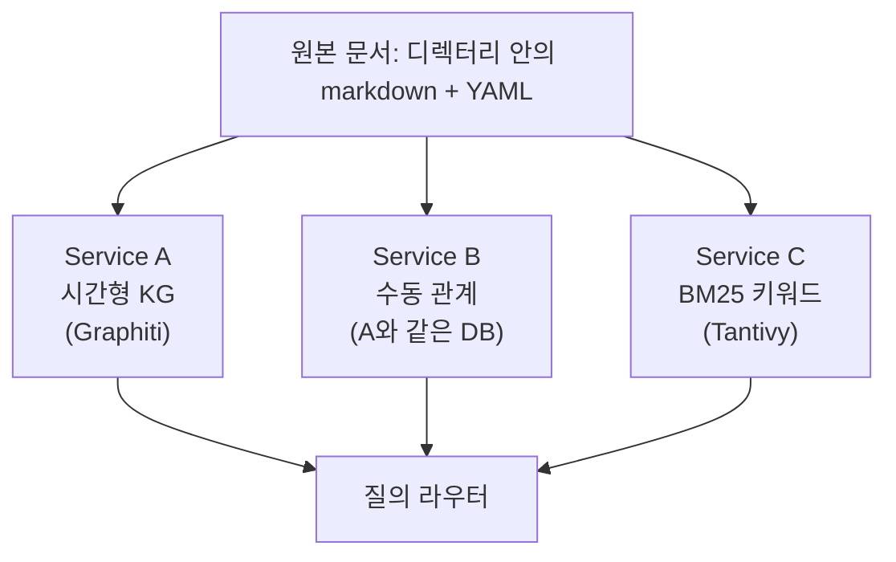

# 문서 관리 시스템 도입

이 문서는 게임 개발 팀을 위해 설계된 문서 관리 시스템(DMS)의 도입을 제안한다.

---

## 1. 문제 정의

> 무엇을 해결하려고 하는가? 근본 원인은 무엇인가?

경험 있는 게임 팀은 기능에 한 명의 작업자를 배정하고, 한 개의 문서로 세부사항을 기록한다. 한 기능에 여러 사람이 책임을 나누면, 기능의 방향이 흔들리고, 결정이 번복되고, 설계 논의에 더 많은 시간을 쓰게 된다. 단독 책임은 설계를 일관적으로 할 수 있게 하고, 지식의 출처를 분명하게 한다. 배정된 작업자가 기능의 현재 상태에 대한 단일 출처가 된다. 문서가 기능의 세부사항과 변경 이력을 담는다.

이 방식에는 단점이 있다. 각 기능을 한 사람의 머리와 한 파일에 두는 방식으로 유지되기 때문에, 기능 사이의 연결은 작업자들의 조율에 전적으로 의존한다. 팀이 작고 기능 수가 적을 때는 작업자들이 그 연결을 머릿속에 담아 둘 수 있다. 팀과 문서가 커지면, 그 방식만으로는 모든 연결을 추적하기 어려워진다. 한 기능의 변경은 여전히 다른 기능들에 영향을 주지만, 문서에는 반영되지 않는다. 작업자들이 회의와 채팅으로 정보를 연결한다. 결국 남는 것들은 낡은 의존 관계, 숨겨진 모순, 그리고 누구도 자신 있게 재구성할 수 없는 결정들이다.

### 갈수록 어려워지는 작업

이런 상황에서 다음과 같은 어려움이 발생한다.

첫 번째로, 승인된 세부 사항의 최신 상태를 따라가기 어렵다. 예를 들어 지금 데미지 공식이 무엇인지에 답하려면, 그 기능을 언급한 가장 최근 문서를 찾고, 다른 문서가 이를 뒤집지 않기를 바라야 한다. 결정이 늘어날수록 이 확인 작업의 비용이 빠르게 늘어난다. 데미지 공식은 중요하기 때문에 한 곳에서 관리하는가? 다른 모든 공식도 같은 방식으로 관리해야 하는데, 거기에 리소스를 할당할 수 있는가?

다음으로, 기능 사이의 관계 추적이 어렵다. 이 스킬을 조정하면 어떤 아이템이 쓸모없어지는지, 어떤 몬스터의 스탯을 다시 조정해야 하는지는, 사람의 기억이나 거의 갱신되지 않는 위키 페이지에 의존한다. 한 기능의 변경이 다른 기능의 세부 사항에 어떤 영향을 주는지 바로 파악하는 것이 매우 어렵다.

### 근본 원인

이 문제의 근본 원인은 세 가지다.

첫째, 문서는 시간이 지나면서 쌓이지만 어떤 문서가 우선하는지 정하는 명확한 규칙이 없다. 새 결정이 옛 결정을 공식적으로 폐기하지 않으며, 가장 최근 문서가 맞는지 아닌지 스스로 알아내야 한다.

둘째, 여러 기능에서 같은 세부 사항을 참조한다. 아이템의 데미지, 공격 속도, 애니메이션 취소 조작, 몬스터의 모션 모두가 데미지 공식에 영향을 준다. 특정 기능에서 세부 사항이 바뀌면 다른 기능들에 영향을 주지만, 구체적으로 어떤 영향이 얼마나 미치는지 손으로 따라가는 일은 어렵다.

셋째, 악마는 디테일 안에 있다. 문장 안에 묻혀 있는 개별 사실을 끄집어내는 일, 그 사실들이 여러 문서에 걸쳐 시간이 지나며 어떻게 바뀌었는지 추적하는 일, 그리고 각 변경이 왜 일어났는지를 기록해 두는 일이 어렵다. 누군가 질문할 때마다 이 작업을 처음부터 다시 해야 한다.

### 제안서가 바꾸는 것들

따라서 우리는 여러 기능과 여러 작성자가 만든 문서들 위에서, 문서 안의 개별 사실 단위로 버전 관리를 해야 한다.

이런 문제들을 줄이기 위해 이 제안을 작성했다. 시스템을 구축하면, 기능 사이의 연결과 한 기능 안의 사실 변경 이력이 작업자의 머리에서 빠져나와 질의 가능한 결과물로 옮겨진다. 의사소통과 조율 비용이 함께 줄어든다. 그러면 여러 작업자가 한 기능을 함께 다룰 수 있게 된다. 기존의 모범 사례에서는 쉽게 허용되지 않던 일이다.

---

## 2. 해결책

> 제안하는 해결책은 무엇인가?

제안하는 해결책은 모듈식 구조의 3 서비스 스택이다. 하나의 공유 원본 문서 집합을 여러 서비스가 각각 읽는다. 각 서비스는 자체 수집 파이프라인과 저장소를 가진다. 얇은 라우터가 사용자 질의를 적절한 서비스로 보낸다. AI 에이전트를 위한 읽기 전용 MCP 래퍼는 후속 단계에서 추가한다.

### 구체적인 작업 과정 변화

도입 후 디자이너의 작업 과정에서 크게 네 부분이 달라진다.

한 번의 검색으로 이력을 조회할 수 있다. "데미지 공식이 어떻게 변해 왔는가?"에 답하기 위해 문서를 읽고 답을 직접 재구성해야 한다. 시스템을 통해 검색을 실행하면 변경 내역에 날짜와 출처 문서 인용이 붙는다.

새 문서 추가는 시스템과 진행하는 절차가 된다. 게임 디자이너가 문서를 쓰면 시스템이 세부사항을 분해한 결과를 제안한다. 어떤 세부사항이 바뀌었는지, 어떤 이전 사실이 더 이상 유효하지 않은지를 짚는다. 디자이너는 맞는 것은 받아들이고 틀린 것은 고친다. 팀의 지식 그래프가 한 번에 갱신된다. 문서는 커밋되는 순간부터 질의 가능한 결과물의 일부가 된다.

팀은 사실들을 손으로 추적하지 않아도 된다. 시스템이 기능별 현재 상태 페이지, 변경 이력, 그리고 게임 디자이너들이 머릿속에 담아 두던 의존 관계 목록을 대신 관리한다. 디자이너의 시간은 설계에 쓰인다.

여러 디자이너가 같은 기능에 동시에 기여할 수 있다. 작업자들이 회의와 채팅으로 떠안던 의사소통 비용을 이제 시스템이 담당한다. 각자 문서를 쓰면 시스템이 사실을 모아 통합한다.

### 사용자 역할

시스템에는 두 사용자 역할이 있다.

사람은 모든 것을 쓴다. 문서를 등록하고, 프론트매터를 편집하고, 수동 관계를 정리한다. 그리고 모든 것을 읽는다. 인증 범위는 `human`이다.

AI 에이전트는 읽기만 한다. 문서나 관계를 작성할 수 없다. 인증 범위는 `agent`이며, 토큰 예산을 인식하는 결과를 받고, 모든 사실에 출처가 함께 표시된다.

라우터는 서비스를 호출하기 전에 토큰 범위를 먼저 확인하여 이 규칙을 강제한다. 쓰기 엔드포인트는 `agent` 토큰에 대해 403을 돌려준다. LLM이 환각으로 쓴 내용은 원본 문서를 망가뜨릴 수 있으므로(https://arxiv.org/abs/2604.15597), 작성은 사람만 한다.

시스템 구조는 다음과 같다.

각 서비스의 역할은 다음과 같다.

- Service A — 시간형 KG
  - 역할: 기능 이력, 현재 상태, AI가 추출한 기능 간 관계.
  - 기술 스택: Graphiti와 Neo4j.
- Service B — 수동 관계
  - 역할: 사람이 정리한 기능 간 관계를 출처와 함께 저장.
  - 기술 스택: Service A와 같은 Neo4j에 보관하며, `source: manual` 플래그로 구분.
- Service C — BM25 키워드
  - 역할: 빠른 키워드 검색과, Service A가 정상 동작하지 않을 때의 대체 경로.
  - 기술 스택: Tantivy 또는 Whoosh, 팀이 사용하는 언어에 맞는 토크나이저(예: 한국어는 mecab-ko).
- 질의 라우터
  - 역할: 단일 진입점. 질의 종류를 서비스로 매핑하고, 토큰 범위를 강제하고, 서비스 간 필터를 적용하고, 서비스가 정상 동작하지 않을 때의 대체 경로를 처리한다.
  - 기술 스택: Flask 또는 FastAPI.
- MCP 서버 (후속 단계)
  - 역할: 라우터의 엔드포인트들을 에이전트 도구로 노출하는 읽기 전용 어댑터(`feature_history`, `feature_current`, `feature_related`, `search_keyword`, `feature_list` 등).
  - 내부적으로 `agent` 범위의 토큰을 사용하여 라우터를 호출한다.
  - 기술 스택: Python MCP SDK.

### 에디터 커넥터

이 제안서에서는 게임 디자이너의 문서 편집기와 시스템을 잇는 단일 커넥터를 함께 제공하지 않는다. 문서를 추가할 때는 새 문서나 변경된 문서를 감지하고, YAML 프론트매터를 로컬에서 검증하고, 수집 웹훅을 호출한다. 시스템이 추출한 제안을 가져와 하나씩 디자이너에게 보여 주고, 각 세부 단위에 대한 받아들임/수정/거절 결정을 시스템에 다시 보낸다. 이 커넥터는 다음 두 이유 때문에 도입 팀이 직접 만들어야 한다.

첫째, 이 작업은 디렉터리 감시, YAML 파싱, HTTP 엔드포인트 호출등을 담당하는 전형적인 글루 코드다. 에이전틱 코딩이 잘 처리하는 영역이며, AI 보조 에디터를 쓰는 엔지니어 한 명이 하루 이틀이면 동작하는 커넥터를 만들 수 있다.

둘째, 팀마다 환경이 너무 달라서 하나의 커넥터로 맞추기 어렵다. 게임 팀이 사용하는 텍스트 에디터는 VS Code, Obsidian부터 평범한 텍스트 에디터까지 다양하다. 저장하는 프로세스도 "저장하고 공개"부터 "git push로 트리거"까지 다양하다. 형상 관리 방법 또한 git부터 공유 드라이브까지 다양하다. 모두에게 맞추기 위한 솔루션은 너무 복잡하다.

대신에 커넥터가 호출할 안정된 인터페이스를 제공한다.

- 원본 문서 위치: 팀이 설정하는 디렉터리 경로
- 프론트매터 스키마: 검증되는 `feature_id`와 그 외 필수 필드를 JSON 스키마로 게시한다.
- 수집 엔드포인트: `PATCH /docs/{id}`. 문서 본문을 보내면 추출된 제안 묶음을 돌려준다.
- 제안 검토 엔드포인트. 각 제안은 하나의 세부 단위(기능-속성 쌍 또는 관계 트리플 또는 시간이 붙은 사실)이며, 디자이너는 다음 기능을 통해 적용 여부를 결정한다.
  - `GET /docs/{id}/proposals` — 디자이너의 검토를 기다리는 제안 목록을 가져온다.
  - `POST /docs/{id}/proposals/{pid}/accept` — 제안 그대로 받아들인다.
  - `PATCH /docs/{id}/proposals/{pid}` — 수정한 값으로 받아들인다.
  - `POST /docs/{id}/proposals/{pid}/reject` — 거절한다(한 줄 사유 필수).
- 인증: 작성자별로 발급되는 `human` 범위 토큰.

CLI부터 시작한다. 가장 만들기 쉬운 형태이며, 에이전틱 코딩이 하루면 골격을 만들어 준다. Phase 0 동안 디자이너가 시스템을 써 보기에 충분하다. 에디터 플러그인이나 더 풍부한 워크플로우는 팀이 디자이너의 실제 필요를 알게 된 뒤에 추가하면 된다. CLI 커넥터는 원본 문서 디렉터리와 Service C와 함께 Phase 0에 만든다.

### 수집: 디자이너가 문서를 추가할 때 일어나는 일

수집 경로는 환각으로 만들어진 사실이 지식 그래프에 들어가지 않도록 막는다. 작성은 사람만 한다. LLM은 분해를 제안하고, 디자이너가 확정한다.

다섯 단계로 진행된다.

첫째 단계는 프론트매터 파싱과 검증이다. 시스템이 YAML 프론트매터를 읽고, `feature_id`가 `features_catalog.yaml`에 등록되어 있는지 확인한다. 검증에 실패하면 디자이너가 프론트매터를 고친 뒤에야 다음 단계로 넘어간다.

둘째 단계는 세부 사실 제안이다. LLM이 문서를 읽고 세부 사실들의 목록을 제안한다. 기능-속성 쌍(예: `combat-system.damage_formula = "2*STR + WPN"`), 엔티티-관계 트리플(예: combat-system depends-on stats-system), 시간이 붙은 사실(예: effective-from = 문서의 날짜) 등이다. 각 제안에는 신뢰도 점수가 함께 붙는다.

셋째 단계는 제안의 등급 분류다. 신뢰도가 높은 제안(프론트매터 필드, 헤딩, 구조화된 표, 이름이 명확한 필드 등)은 자동으로 적용된다. 신뢰도가 낮은 제안(자유 형식 문장에서 뽑은 사실, 추론된 관계, 구조화된 필드에서 직접 인용되지 않은 모든 것)은 사람의 검토 큐로 들어간다.

넷째 단계는 디자이너의 검토다. 커넥터가 제안 검토 엔드포인트로 큐에 쌓인 제안들을 가져와 그것을 만들어 낸 원문과 나란히 디자이너에게 보여 주고, 디자이너의 받아들임/수정/거절 결정을 받는다. 거절할 때는 한 줄짜리 이유를 적어야 하며, 이 이유는 시간이 흐르며 프롬프트 튜닝에 다시 반영된다.

다섯째 단계는 확정이다. 받아들여진 제안은 `source: ai-extracted`와 타임스탬프와 함께 Service A에 기록된다. 원본 문서는 Service C가 키워드 검색용으로 인덱싱한다. 디자이너는 그 후 언제든지 Service B에 연관 관계를 수동으로 추가할 수 있다.

한 번에 전부 승인할 수 있게 하면, 마감에 쫓길 때 디자이너가 검토 없이 통과시키게 된다. 이미 구조화되어 있는 부분, 즉 프론트매터와 헤딩만 자동으로 받아들이도록 하면, 디자이너는 LLM의 해석만 판단하면 된다. 오류가 가장 자주 생기는 곳이 그곳이기 때문이다. 등급이 잘 맞춰져 있는지는 5장에서 추적하는 제안 거절률로 확인할 수 있다.

### 라우팅

라우터는 질의의 의미를 해석하지 않고, 엔드포인트 URL을 보고 라우팅을 결정한다. 각 질의 종류는 주 서비스와, 주 서비스가 정상 동작하지 않을 때 사용할 대체 서비스를 가진다.

- `GET /feature/{id}/history`
  - 주: Service A (Graphiti `facts(all_time=true)`).
  - 대체: Service C에 `X-Degraded: history-via-text-match` 헤더.
- `GET /feature/{id}/current`
  - 주: Service A (Graphiti `facts(valid_now=true)`).
  - 대체: Service C에 `X-Degraded: current-via-text-match` 헤더.
- `GET /feature/{id}/related?source=manual|ai|all`
  - 주: Service A (Cypher에서 `r.source` 필터 적용).
  - 대체 없음. A가 동작하지 않으면 503 반환.
- `GET /search?q=` (키워드)
  - 주: Service C (BM25).
  - 대체: Service A의 하이브리드 검색에 `X-Degraded: keyword-via-graph` 헤더.
- `GET /docs/{id}`
  - 주: 원본 문서 (파일 읽기).
  - 대체 없음. 파일이 없으면 404.
- `PATCH /docs/{id}`
  - 주: 원본 문서 (파일 쓰기 + 재수집 웹훅).
  - 대체 없음. 쓰기 실패 시 503.
- `POST /feature/{id}/relationship`
  - 주: Service A (Cypher에 `source: "manual"`로 INSERT).
  - 대체 없음. A가 동작하지 않으면 503.

라우터는 다음 네 필터를 순서대로 적용해 결과를 좁힌다.

1. `team_namespace` (서버 측) — 요청한 팀의 네임스페이스에 속한 문서로 결과를 제한한다.
2. `exclude_filter` (라우터 측) — 프론트매터에 `exclude: true`가 설정된 문서를 제거한다.
3. `feature_id` — 호출자가 특정 기능으로 범위를 좁힐 때 적용된다.
4. `importance_min` — 최소 중요도 점수 미만의 결과를 제거한다.

서비스 헬스 체크는 30초마다 실행된다. 서비스가 정상이 아닐 때 라우터는 자동으로 대체 경로를 사용한다.

### 그 외 설계 결정

이 외 설계 결정들은 다음과 같다.

- 원본 형식은 markdown과 YAML 프론트매터다. git으로 관리하든, 그냥 파일로 두든 검색 계층에는 영향이 없다.
- `feature_id`는 문서 프론트매터에 명시되며, 통제된 `features_catalog.yaml`에 대조해 검증된다.
- 세부 사항에 대한 두 개 시간축 기반 무효화는 세부 사항의 이력을 유지하면서도 현재 상태 질의에 깔끔하게 답한다.
- 수동으로 추가한 기능 간 관계는 AI가 추출한 관계와 같은 저장소를 쓰며, `source` 속성으로 구분한다. 그래서 사람의 정리 작업에는 별도 인프라가 필요하지 않다.
- Phase 2 동안 Mem0-g가 2주 간 그림자 모드로 함께 돌아가며 Service A의 검증된 대안 역할을 한다.
- 라우터는 URL 경로를 보고 라우팅 표를 따른다. 동적 결합, 캐시, 자유 텍스트 파싱은 이 제안의 범위가 아니다.

### 단계별 구축 계획

작업은 단계로 나누어 진행한다.

- Phase 0 (1~3일)
  - 제공: 원본 문서, Service C, CLI 커넥터.
  - 효과: 키워드 검색 질의가 200ms 이내에 상위 5개 결과를 돌려준다. 디자이너는 CLI로 문서를 등록할 수 있다.
- Phase 1 (1~2주)
  - 제공: LLM 보강과 프론트매터 완성.
  - 효과: 모든 문서가 `feature_ids`, `tags`, `summary`를 가진다. 기능 범위로 좁힌 검색이 동작한다.
- Phase 2 (3~4주)
  - 제공: Service A (Graphiti)와 Mem0-g 그림자 운영.
  - 효과: "데미지 공식이 어떻게 변해 왔는가?" 같은 질의가 깔끔한 시간선을 돌려준다.
- Phase 3 (2개월차)
  - 제공: Service B와 거버넌스 적용.
  - 효과: 팀이 "기능 A는 기능 B에 의존한다" 같은 관계를 정리할 수 있고, 질의는 사람이 만든 관계와 AI가 만든 관계를 출처 표시와 함께 모두 돌려준다.
- Phase 4 (3개월차, 선택)
  - 제공: Service D(기능별 LLM 요약).
  - 효과: 사람이 읽기 좋은 기능별 페이지가 만들어진다.
- Phase 5 (이후, 기간 정해지지 않음)
  - 제공: 에이전트용 MCP 서버, Service E(RAPTOR), 언어 튜닝, 피드백 학습.
  - 시작 시점: 에이전트 도입이나 사용 신호에 따라 결정.

---

## 3. 트레이드오프

> 풀어야 할 본질적인 충돌은 무엇인가?

### 핵심 고려사항

핵심적으로 고려할 사항은 규모와 풍부함 사이에 있다. 한쪽 끝에는 Karpathy의 LLM 위키 방식이 있다. 기능별로 LLM이 갱신하는 페이지를 두는 방식이며, 약 100개 문서 규모에서는 매우 좋은 검색 품질을 보여 주지만 그보다 큰 크기에서는 상대적으로 부족한 성능을 보인다. 다른 쪽 끝에는 일반 RAG가 있다. 원시 문서 조각을 인덱싱하여 수백만 개 문서까지 확장되지만, 지식을 쌓지 못한다. 모든 질의가 답을 처음부터 다시 만들고, 시간 모델이 없다.

올바른 답은 그 사이에 있다. 게임 팀에는 시간이 지날수록 자라면서, 모든 질의에서 답을 다시 만들어 내지 않고도 확장되는 구조화된 질의 가능한 결과물이 필요하다.

### 부수적 고려사항

이 설계에서 따라오는 주요 고려사항들은 다음과 같다.

- 단일 통합 시스템 vs 다중 서비스 — 다중 서비스를 선택한다.
  - 통합 시스템은 처음에는 단순하지만, 한 벤더의 설계 방향에 팀이 묶이게 된다.
  - 다중 서비스라면 각 서비스를 독립적으로 교체할 수 있다.
- AI가 추출한 관계 vs 사람이 만든 관계 — 둘 다 사용한다.
  - AI는 확장성이 있지만 노이즈가 있다.
  - 사람은 정확하지만 느리다.
  - 둘 다 운영하고, 사람이 AI를 교정하고, 모든 관계에 출처를 표시한다.
- 두 개의 시간축을 가진 사실 vs 추가만 가능한 사실 — 두 시간축을 선택한다. 오래된 사실은 지우지 않고, 더 이상 유효하지 않다고 표시한다.
  - 두 시간축 사실은 두 개의 날짜를 가진다. 하나는 사실이 실제로 효력을 가지는 시점(유효 시간)이다. 다른 하나는 시스템이 그것을 기록하는 시점(기록 시간)이다. 둘은 다를 수 있다. 3월 5일에 문서로 남긴 변경이 다음 스프린트가 시작하는 4월 1일부터 효력을 가질 수 있다.
  - 추가만 가능한 방식은 현재 상태 개념을 잃는다.
  - 갱신 시 교체하는 방식은 이력을 잃는다.
  - 두 시간축 모델은 둘 다 유지하며, 그에 따른 저장 비용은 대부분의 팀이 감당할 수 있다.
- 직접 만들기 vs 구매하기 — 오픈 소스(Graphiti) 위에서 직접 만든다.
  - 관리형 서비스인 Zep을 구매하는 것은 비싸고 독점이다.
  - Zep 내부의 오픈 소스 엔진인 Graphiti는 같은 기능을 팀의 자체 인프라 비용으로 제공한다.
  - 나중에 관리 지원을 받을 가치가 있다면 Zep으로 옮길 수 있다.
- 별도 수동 관계 서비스 vs 공유 저장소 — 출처 플래그를 붙인 공유 저장소를 선택한다.
  - 수동 관계를 위한 별도 데이터베이스는 작은 데이터에 비해 운영 부담이 두 배가 된다.
  - Service A의 그래프에 `source: manual` 속성으로 저장하면 감사 추적이 가능하면서 추가 인프라가 들지 않는다.
- 엄격한 최신 우선 vs 이력 유지형 무효화 — 이력 유지형 무효화를 선택한다.
  - 사용자가 원한다고 말하는 것은 엄격한 교체이지만, 무효화 방식은 그 이상을 준다.
  - 모든 변경의 전체 이력이 남으면서도 현재 상태 질의는 그대로 가능하다.

### 설계 단점

이 제안에서는 다음과 같은 단점을 수용한다.

- 세 개의 서비스를 운영하는 것은 단일 서비스에 비해 운영이 복잡하다.
  - 각 서비스를 독립적으로 교체할 수 있다는 이점 때문에 이 복잡성을 받아들인다.
- 새 문서가 들어올 때마다 LLM이 엔티티-관계 추출을 수행하며, 비용은 Haiku급 가격에서 문서 1,000개당 몇 달러 수준이다.
- Service A와 C는 같은 원본 문서를 인덱싱하므로 일부 작업이 중복된다.
  - 한쪽 서비스를 교체해도 다른 쪽 데이터가 사라지지 않는다는 이점 때문에 이 중복을 받아들인다.

---

## 4. 벤치마크

> 가장 좋은 기존 해결책은 무엇이며 그 이유는?

메모리 시스템과 검색 증강 생성(RAG) 분야의 13개 후보 시스템을 검토했다. 게임 개발 팀의 필요에 얼마나 잘 맞는지를 기준으로 상위 후보를 정리하면 다음과 같다.

### 주요 후보

1. Graphiti (`getzep/graphiti`)
   - Apache-2.0 오픈 소스.
   - 사실이 바뀌면 자동으로 무효화되는 두 시간축 지식 그래프를 제공한다.
   - Neo4j, FalkorDB, Kuzu, Neptune 등 여러 백엔드를 지원한다.
   - 의미 검색, BM25, 그래프 순회를 결합한 하이브리드 검색을 제공한다.
   - 게임 팀의 필요에 맞게 설계된 시스템이다.
2. Mem0-g (`mem0ai/mem0`)
   - Apache-2.0. Neo4j 기반의 그래프형 Mem0 변형이다.
   - 사실에 대해 명시적인 ADD, UPDATE, DELETE, NOOP 연산을 제공하므로 시간 순으로 사실을 잘 정렬할 수 있다.
   - 대화형 프레임이 있어 Graphiti보다 손볼 부분은 많지만, 검증된 차선책이 될 만큼 충분한 능력을 갖추고 있다.
3. HippoRAG와 HippoRAG 2 (`OSU-NLP-Group/HippoRAG`)
   - 개인화된 PageRank로 관련 기능 순위를 잘 매긴다.
   - 추가만 가능한 그래프이며 시간 모델이 없다.
   - 주 후보는 아니지만 특정 슬롯에 쓸 수 있을 가능성이 있다.
4. Karpathy LLM 위키 패턴
   - 시스템이 아니라 패턴이다.
   - 기능별 위키 페이지가 명시적인 `feature_id` 요구사항과 잘 맞는다.
   - 작은 규모에서만 작동한다.
   - 사람이 읽을 수 있는 기능별 요약이라는 선택적 후속 서비스에 영감을 준다.
5. A-Mem (`agiresearch/A-mem`)
   - Zettelkasten에서 영감을 받은 노트 연결 방식이다.
   - AI 관계 슬롯에서 HippoRAG의 흥미로운 대안이다.
   - 메모리 진화 방식이 사실을 교체하지 않고 속성을 다듬는 방식이라 최신 우선 요구에는 맞지 않지만, 관련 기능 순위 매기기에는 쓸 수 있다.

### 탈락한 시스템

탈락한 시스템들은 다음과 같다.

Memobase는 사용자 프로필 추상화에 한정된다. 저자들 스스로 "에이전트가 아닌 사용자를 위한 메모리"라고 설명한다. 대화형 벤치마크에서 가장 높은 점수를 받았지만, 시간 모델이 대화에 맞춰져 있어 기능 상태 검색에는 맞지 않다.

MemGPT와 Letta는 한 LLM이 세션을 가로질러 자기 메모리를 관리하는 에이전트 런타임 시스템이다. 추상화는 공유 문서 인덱스에는 맞지 않다.

MemoryOS는 사용 빈도 기반 제거 방식으로 오래된 메모리를 지운다. 이력을 유지해야 하는 요구사항을 정면으로 거스른다.

StructMem은 연구 단계의 코드이며 대화형 프레임이 있다. 일부 패턴(이중 관점 추출, 타임스탬프 고정, 주기적 통합 등)은 수집 파이프라인에 가져올 가치가 있지만, 시스템 자체는 이 용도에 배치하기 어렵다.

Microsoft GraphRAG는 HippoRAG와 같은 계열이며, HippoRAG가 더 최근의 결과물이다.

Zep은 Graphiti 팀이 만든 관리형 서비스다. Mem0 논문은 Zep이 토큰 비용이 높고(대화당 60만 토큰 이상) 수집이 느리다는 점(시간 단위)을 지적한다. Graphiti가 Zep 내부의 오픈 소스 엔진이므로, 도입 팀은 Graphiti를 직접 사용할 수 있다.

PageIndex는 한 문서 내부의 구조 탐색을 위한 것이며, 여러 문서에 걸친 사실 집계에는 맞지 않는다.

MiniRAG, LightRAG, LangMem은 일반 RAG나 평면 메모리 패러다임이며, 구조화된 메모리의 빈자리를 채우지 않는다.

### 통합 시스템을 고르지 않는 이유

왜 한 개의 통합 시스템을 고르지 않는가? 검토한 모든 통합 시스템은 둘 중 하나다. 형태가 이 용도에 맞지 않거나(Memobase, MemGPT, MemoryOS, StructMem은 모두 단일 에이전트나 단일 사용자 중심), 한 슬롯에만 강하다(HippoRAG는 추가형 그래프 검색, A-Mem은 노트 연결, RAPTOR는 계층 요약). 가장 가까운 두 시스템인 Graphiti와 Mem0-g는 시간형 그래프 슬롯을 잘 채우지만, 어느 쪽도 사람이 만든 관계 관리나 BM25 키워드 검색을 기본으로 제공하지 않는다. 그 슬롯들을 별도 서비스로 추가하는 비용이 통합 시스템에 무리하게 끼워 넣는 비용보다 작다.

---

## 5. 측정 기준

> 성공과 실패를 어떻게 측정할 것인가?

각 단계마다 성공 측정 지표를 둔다. 도입 팀이 추적할 수 있는 구체적 목표도 있다.

### Phase 0
- 인덱스 커버리지
  - 목표: 기존 문서의 100%가 인덱싱됨.
  - 출처: 수집 로그.
- 질의 지연시간
  - 목표: 200ms p95 미만.
  - 출처: Service C 메트릭.

### Phase 1
- 프론트매터 완성도
  - 목표: 문서의 90% 이상이 `feature_ids`, `tags`, `summary`를 갖춤.
  - 출처: 프론트매터 감사 스크립트.
- LLM 자동 태그 수용률
  - 목표: 20개 문서 수동 표본에서 80% 이상.
  - 출처: 제안 검토 로그.

### Phase 2
- 이력 질의의 Recall@5
  - 목표: 팀이 만든 골드 평가 셋 기준 0.80 이상.
  - 출처: 골드 평가 하네스.
- Service A 질의 지연시간
  - 목표: 약 3,000개 문서 규모(팀 규모)에서 1초 p95 미만.
  - 출처: 라우터 메트릭.

### Phase 3
- 수동 관계 작성
  - 목표: 첫 달에 사람이 정리한 관계 30개 이상.
  - 출처: Service B 감사 로그.
- 참조 거절 사유 기록
  - 목표: 거절의 100%에 비어 있지 않은 사유가 기록됨.
  - 출처: API 검증 로그.

### 지속
- 일일 질의량
  - 목표: Phase 2 이후 첫 8주 동안 주 단위로 증가.
  - 출처: 라우터 메트릭.
- 수집 문서당 비용
  - 목표: Haiku급 가격 기준 문서당 $0.005 미만.
  - 출처: LLM API 청구.

### 실패 신호

자동 롤백을 해야 하는 요건은 아니지만, 들여다봐야 하는 실패 신호도 있다.

- Phase 1 이후 프론트매터 커버리지가 70% 미만
  - LLM 보강 품질이 너무 낮을 수 있다.
  - 작성자들이 초안을 거절하고 있을 수 있다.
- Service A 지연시간이 2초 p95를 넘는 상태가 계속됨
  - Neo4j 자원이 부족할 수 있다.
  - 추출이 문서당 너무 많은 엔티티를 만들어 내고 있을 수 있다.
- Recall@5가 0.60 미만
  - 추출 프롬프트가 핵심 사실을 놓치고 있을 수 있다.
  - 골드 셋을 새로 만들어야 할 수도 있다.
- 자동 태그에 대한 사람의 수동 변경 비율이 50%를 넘음
  - 태그 어휘가 작성자들의 실제 사고 방식과 맞지 않는다.
- Phase 2 이후 4주 동안 일일 질의 수가 정체되거나 줄어듦
  - 도입이 멈춘 것일 수 있다.
  - 사용자와 이야기해야 한다.
- 참조 거절 사유에 "제안이 좋지 않다"는 의견이 계속 쌓임
  - Service A의 `related` 질의가 잘못된 이웃들을 보여 주고 있다.

### 측정하지 않는 지표

의도적으로 측정하지 않는 지표도 있다. 그래프에 있는 기능 관계의 총 개수는 유용한 목표가 아니다. 노이즈가 많은 추출만으로도 그 수가 늘어날 수 있고, 그것이 시스템을 더 좋게 만들지는 않기 때문이다. LLM 일치율은 의미가 없다. LLM은 추출자이지 판정자가 아니다. ChatGPT와 검색 순위를 비교하는 것도 공정한 기준이 아니다. ChatGPT는 우리 팀의 문서에 근거하고 있지 않다.

---

## 6. Andon

> 잘못된 경로는 무엇인가? 언제 롤백하기로 결정하는가?

Andon 원칙은 도입 팀의 누구든 언제든 시스템을 멈출 수 있다는 것이다. 멈추는 구체적인 방법은 팀의 운영 문서(runbook)에 기록한다. 핵심은 멈출 권리가 누구에게나 있다는 원칙이다.

아래의 각 신호는 조건의 이름과 그 조건이 충족되었음을 알려 주는 관찰 가능한 지표와 대응의 세 부분으로 구성된다.

### Phase 0
- BM25가 관련 없는 결과를 돌려줌.
  - 관찰: 주간 골드 셋 실행에서 20개 샘플 질의 중 70% 미만이 상위 3위 안에 기대 결과를 포함하지 못하거나, 표본 검토 통과율이 60% 미만으로 떨어진다.
  - 대응: BM25는 그대로 두되 결과에 신뢰도 낮음 표시를 붙인다. 언어 토크나이저를 점검한다. 수정 후 재배포하고 골드 셋을 다시 돌린다.

### Phase 1
- 일괄 보강 비용이 예산을 초과함.
  - 관찰: 일괄 작업의 누적 LLM 비용이 계획 예산의 2배를 넘는다.
  - 대응: 일괄 작업을 멈춘다. 드라이 런 모드로 전환한다. 프롬프트와 문서의 불일치를 점검한다.
- 제안 거절률이 너무 높음.
  - 관찰: 첫 50개 문서의 거절률이 50%를 넘는다.
  - 대응: 신규 문서 보강을 멈춘다. 프롬프트를 다시 검토한다. 자동 적용을 하지 않는다.

### Phase 2
- Graphiti 질의 지연시간이 악화됨.
  - 관찰: p95 지연시간이 5초를 넘는 상태가 24시간 이상 유지된다.
  - 대응: Service A를 Mem0-g로 교체한다. 문제를 고친 뒤 Graphiti를 재평가한다.
- 이력 질의의 재현율이 낮음.
  - 관찰: 골드 평가 셋에서 Recall@5가 0.50 미만이다.
  - 대응: Phase 2 사인오프를 보류한다. 추출 프롬프트와 엔티티 단위 크기를 점검한다.
- Mem0-g 그림자 운영이 Graphiti를 앞섬.
  - 관찰: 2주 그림자 운영 동안 Mem0-g의 Recall@5가 Graphiti보다 5점 이상 높고, p95 지연시간은 더 나쁘지 않다.
  - 대응: Service A를 Mem0-g로 교체한다. 둘 다 두 시간축 그래프이므로 선택은 운영 측면의 결정이다.

### Phase 3
- 수동 관계가 낡거나 AI 관계와 충돌함.
  - 관찰: 수동 관계 중 20% 이상이 작성 후 30일 이내에 수정되거나 삭제되거나, 수집 중 사람-AI 충돌이 주당 10건 이상 검출된다.
  - 대응: Service B의 쓰기를 일시 정지한다. 중복을 정리한다. 사람이 자기 관계를 추가하기 전에 AI 관계를 먼저 보도록 UX를 다시 본다.
- 참조 적용 강제가 문서 제출 속도를 늦춤.
  - 관찰: 강제가 켜진 뒤 신규 문서의 커밋까지 걸리는 시간(중앙값)이 50% 이상 늘어난 상태가 2주 이상 유지된다.
  - 대응: 강제를 권고로 바꾼다. 경고는 띄우되 막지는 않는다. 2주간 데이터를 모은 뒤 다시 강도를 조정한다.

### 모든 단계 공통
- 운영 복잡도가 팀 능력을 초과함.
  - 관찰: 수집이나 질의 계층의 온콜 호출이 주당 1건을 넘는 상태가 한 달 이상 유지되며, 단일한 근본 원인이 보이지 않는다.
  - 대응: Service B를 별도 API 없이 Service A의 저장소로 통합한다(데이터는 이미 그곳에 있다). Service D와 E는 무기한 미룬다.

### 즉시 정지가 필요한 신호

점진적 대응이 아니라 즉시 멈추고 팀 회의를 해야 하는 신호도 있다.

- 감사 로그에 권한 없는 `exclude` 플래그 변경이 보임.
  - 관찰: 큐레이션된 허용 목록에 없는 토큰이 `exclude` 값을 변경한다.
  - 대응: 토큰이 유출되었을 가능성이 있다. 쓰기 API를 동결하고, 토큰을 회전시키고, 조사한다.
- 프론트매터 파싱 오류율이 급증함.
  - 관찰: 24시간 동안 신규 문서의 파싱 오류율이 5%를 넘는다.
  - 대응: 스키마 변동이거나 검증기 버그다. 수집을 멈춘다.
- Service A가 자신 있게 잘못된 답을 돌려줌.
  - 관찰: 주간 표본 검토에서 20개 결과 중 2건 이상에서 반환된 관계가 인용된 원본 문서로 뒷받침되지 않는다.
  - 대응: 추출 품질이 급락한 것이다. Service A 질의를 멈추고 프롬프트를 재평가한다.
- LLM API 비용이 급등함.
  - 관찰: 24시간 비용이 일일 평균의 10배를 넘는다.
  - 대응: 루프나 폭주 프로세스다. 모든 LLM 의존 수집을 일시 정지한다.
- `exclude: true`로 표시된 문서가 결과에 나타남.
  - 관찰: 단일 결과에 프론트매터의 `exclude`가 `true`인 문서가 포함된다.
  - 대응: 서버 측 필터가 망가진 것이다. 고쳐질 때까지 모든 질의를 멈춘다. 프라이버시와 정확성의 경계선이다.
- 에이전트 토큰이 쓰기 엔드포인트에 도달함.
  - 관찰: 쓰기 경로에서 `agent` 범위 토큰의 403 응답이 발생한다.
  - 대응: 설정 오류이거나 권한 상승 시도일 수 있다. 토큰 발급자를 조사한다. 쓰기 경로의 범위 검사가 올바르게 적용되어 있는지 확인한다.
- 단일 에이전트 토큰이 정상 트래픽을 크게 초과함.
  - 관찰: 단일 에이전트 토큰이 24시간 동안 토큰 단위 요청률 중앙값의 50배 이상을 만든다.
  - 대응: 폭주 스캔이거나 재시도 루프에 빠진 것이다. 토큰을 정지하고, 다시 발급하기 전에 조사한다.

### 부분 정지로 충분한 경우

전체 롤백이 아니라 일부 기능만 정지되는 경우도 있다. 

- Service A가 다운되면 Service C(BM25)가 모든 질의를 받고 UI에 검색 전용 모드 알림을 표시한다.
- LLM API가 다운되면 수집은 큐에 쌓이고 기존 데이터는 여전히 질의 가능하다.
- Neo4j가 다운되면 Service A와 B는 모두 사용할 수 없지만 Service C는 동작한다.

---

## 7. 피드백 절차

> 어떻게 계속 개선해 나갈 것인가?

### 매일 살피는 신호

다음 신호들을 매일 살핀다.

- 질의 라우터 메트릭(서비스별 지연시간, 트래픽, 오류율)은 실시간 대시보드로 본다. 사람과 에이전트의 트래픽은 패턴이 다르므로 따로 추적한다.
- 수집 파이프라인 메트릭(문서당 LLM 호출 비용, 추출률, 검증 거절)은 일일 요약으로 정리한다.
- 에이전트 토큰 활동(토큰별 분당 요청 수, 범위 위반 403, 가장 많이 질의된 `feature_id`들)이 급증하는지 파악하고, 어떤 것을 캐시할지 판단하기 위해 모니터링한다.

### 매주 수행하는 검토

다음 검토를 매주 수행한다.

- 작성자 통계 보고는 누가 기여하고 있고 어떤 영역이 부족한지를 보여 준다.
- 질의 통계 보고는 어떤 문서와 기능이 가장 많이 질의되는지를 보여 주며, 기능이 있어야 할 자리에 문서가 없는 빈자리를 찾는 데 도움이 된다.
- 참조 거절 사유 모음을 분류하고(LLM이 잘못된 기능을 제안했는지, 잘못된 범위를 제안했는지, 실제 관계가 아닌데 제안했는지), 그 패턴을 추출 프롬프트 튜닝에 반영한다.

### 매월 수행하는 반복

다음 작업을 매월 반복한다.

- 골드 평가 셋을 다시 돌린다. Recall@5가 월 단위로 5점 이상 떨어지면 조사한다.
- 태그 어휘를 검토한다. 어떤 항목이 사용되지 않는지, 어떤 항목이 너무 자주 사용되어 분리해야 할 신호인지 본다. 어휘를 갱신한 뒤, 표본 묶음을 새 어휘로 다시 돌려서 검증한다.
- 기능 카탈로그도 검토한다. 30일 이상 손대지 않은 `feature_id`는 무엇인가? 여전히 살아 있는 기능인가, 아니면 `deprecated`로 옮겨야 하는가?

### 매 분기 수행하는 회고

다음 회고를 매 분기 수행한다.

- 시스템 수준에서, 3 서비스 스택이 여전히 맞는 모양인지 묻는다. Service B를 Service A로 합쳐야 할까? Service D를 출시해야 할까?
- Mem0-g와 Graphiti를 다시 비교하고, 첫 2주 시제품에서 본 운영 증거가 여전히 같은 방향을 가리키는지 본다.
- 도입 자체도 검토한다. 시스템이 의도대로 사용되고 있는가, 아니면 실제 사용이 설계와 달라졌는가? 달라졌다면, 어느 쪽이 맞는지 묻는다. 설계인지 사용자인지.

### 직접 피드백 채널

도입 팀은 직접 피드백을 줄 수 있다. 관련 기능과 검색 엔드포인트의 결과마다 좋아요와 싫어요 옵션이 있으며, 매주 데이터로 읽는다(지시가 아니라 데이터로). 팀 Slack 채널에서 자유 텍스트 의견을 모은다.

### 신호와 변경의 연결

피드백은 구체적인 변경으로 이어진다.

- 참조 거절 사유에 "관련 없음"이 계속 쌓임
  - 추출 프롬프트를 조정한다.
  - 추출용 LLM의 재학습도 고려한다.
- 태그에 대한 수동 변경 비율이 50%를 넘음
  - 어휘를 분리하거나 다시 표시할 필요가 있다.
  - 변경 내역을 라벨링된 데이터셋으로 모은다.
- "유용했다"는 사용자 피드백이 줄어드는 추세
  - 질의 종류별로 조사한다.
  - 라우터 변경이 필요할 수 있다.
- 특정 기능이 수동 관계가 0이고 AI 관계만 많음
  - AI가 과추출하고 있거나, 사람이 아직 정리하지 않은 것이다.
  - 조사한다.
- 자주 실패하는 질의가 있음
  - 골드 셋에 추가한다.
  - 다음 반복의 테스트 케이스로 다룬다.
- 에이전트와 사람의 질의 패턴이 크게 갈라짐
  - 예: 에이전트는 `/changes`나 `/features/list`에 몰리고 사람은 `/feature/{id}/current`에 몰린다.
  - 두 역할이 서로 다른 필요를 가진 것이다.
  - 사람용 동작은 그대로 두고, 에이전트용 엔드포인트 최적화(자주 쓰는 기능 캐시, 묶음 응답 등)를 고려한다.
- 에이전트 트래픽이 전체 부하의 대부분을 차지함
  - 비용과 용량을 다시 평가한다.
  - 에이전트의 질의당 LLM 토큰 비용을 줄이기 위해 Service D(기능별 LLM 요약) 도입을 고려한다.

---

## 마무리

시스템을 도입 후 개발 절차가 다음과 같이 변화한다. 한 기능에 한 명의 작업자라는 모범 사례가 더 이상 유일하게 안전한 선택이 아니게 된다. 회의와 채팅으로 떠안던 의사소통 비용을 시스템이 담당하기 때문이다. 팀이 원할 때, 여러 디자이너가 한 기능에 함께 기여할 수 있다. 이력 조회는 한 번의 질의로 끝난다. 문서 추가는 시스템과 함께 진행하는 정해진 절차가 된다. 디자이너는 정리 작업에 시간을 덜 쓰게 된다. 하나하나는 작은 변화지만, 프로젝트가 진행될 수록 누적된다.

이 제안은 한 기능에 한 명의 작업자라는 모범 사례를 따르고 있고, 그 단점을 일상 업무에서 느끼고 있으며, 그 사례의 이점을 잃지 않으면서 비용을 줄이고 싶은 게임 팀을 대상으로 한다. 그 단점을 느끼지 않는 팀은 지금의 방식을 유지해도 된다. 문서가 100개 미만인 팀은 Karpathy LLM 위키 패턴만 적용해도 충분하며, 문서가 늘어나면 다시 검토할 수 있다.
