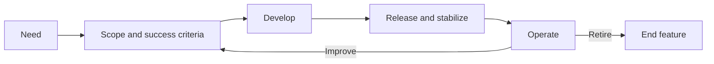
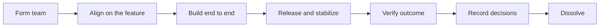
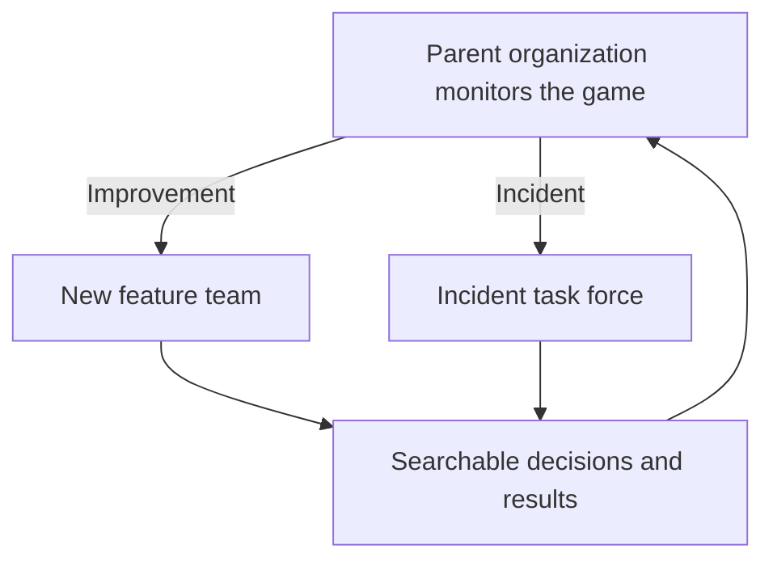
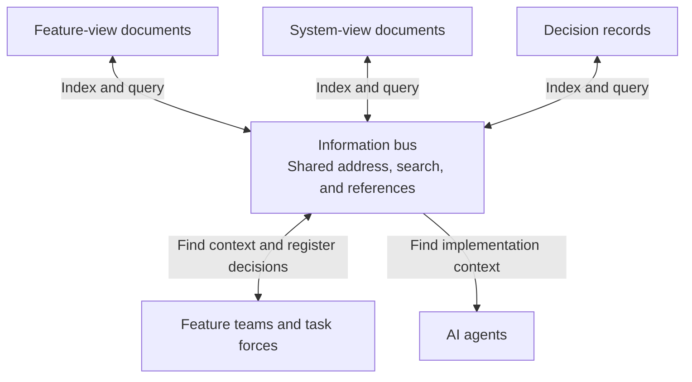
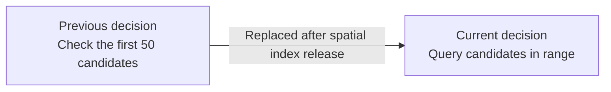

# 1. Agentic coding changes boundaries, not human limits

A game programmer can now cross technical boundaries that once divided a task among several people. The same programmer can change client code, server logic, engine code, and tools with an agent.

This has prompted calls to drop titles such as gameplay, server, engine, and tools programmer. If one person can work across the stack, dividing a feature by specialty can look wasteful.

That view gets the handoff problem right. Every handoff creates another interpretation of the feature, which can blur intent and leave someone waiting on another specialist.

Giving the whole feature to one person creates a different problem. The range of code a person can produce has grown faster than the range of decisions they can review with confidence.

A team should cover the gaps no individual can see, without splitting one player outcome into disconnected pieces of work.

I propose giving a small team vertical ownership of a feature, while expertise moves horizontally between teams. Agentic coding makes this structure more practical while specialists remain necessary.

This proposal is for game development. Team size and coordination will vary by project stage and technical architecture. Industries that require legal separation of duties or independent approval will need a different structure.

# 2. One feature, two perspectives

Consider an area-of-effect skill in an MMORPG. To a player, the skill begins with an input, affects a group of targets, produces visible results, and creates an opportunity for the next decision.

Building that skill requires two kinds of decisions. I call them the functional perspective and the system perspective.

## The functional perspective

The functional perspective defines the experience the skill should produce.

It covers the skill's role in combat, valid targets, damage, secondary effects, resource cost, and cooldown. It also covers the flow from input to feedback and the player's next action.

These decisions describe what should happen. They become the feature's intent and success criteria.

## The system perspective

The system perspective defines how the game can produce that experience correctly and consistently.

The server must validate input, find targets, resolve hits, apply buffs and status effects, record combat events, and resist abuse. The client must present the result without exceeding its frame or effect budget.

Networking adds more choices. The team must decide where results are calculated, how they are propagated, and what the player sees when latency delays the authoritative result.

Each choice belongs to a larger system. A rule that works for one skill can still conflict with combat rules used everywhere else.

## Combining the perspectives

The team should not review every feature against every system concern at the same depth. It should select the concerns that follow from the feature's intent and likely risks.

For a large area-of-effect skill, effect performance matters on the client. Target search and processing cost matter on the server. Result propagation matters on the network.

The team must decide how many effects it can show without hiding hit feedback, and how far the server should search without omitting targets the skill promises to hit.

An agent needs these joined decisions. Giving it a catalog of every system principle is less useful than explaining which principles apply to this feature, and why.

# 3. Every handoff reinterprets the feature

Suppose the skill should damage many enemies across a wide area. A client programmer sees the cost of displaying many effects. A server programmer sees the cost of searching a large set of targets.

The client programmer may cap the number of effects shown at once. The server programmer may reduce server load by checking the distance of only the first 50 candidate targets.

Each limit is reasonable within its own system, but together they change the feature. Some valid targets are never hit, while some hits are too unclear for the player to understand the result.

Neither programmer may know about the other limit. Tests of each component can pass. The mismatch appears when the complete feature is played, after both implementations already feel finished.

Calling this carelessness misses the structure of the problem. People interpret information through their own knowledge, responsibilities, and experience.

[Keysar and colleagues' experiments](https://www.psychologicalscience.org/journals/psychological-science/1467-9280.00211/) found that listeners sometimes used their own perspective first, then corrected it with shared information.

[Paul Carlile's study of new-product development](https://doi.org/10.1287/orsc.13.4.442.2953) describes knowledge as localized within functions. When dependent functions work together, those differences can create knowledge boundaries.

[Research on cross-functional teams](https://doi.org/10.1177/0093650212469402) also links specialized, practice-bound knowledge to difficulty in building a shared memory of who knows what.

More detailed handoff documents reduce ambiguity, but people still interpret them. The team must combine the perspectives while the feature is still taking shape.

Agentic coding removes some of those handoffs. One programmer can implement the client effect and server search in the same context, without explaining the feature twice or waiting for two work queues.

It also removes a point when another specialist would naturally ask questions. The implementer must now spot the gap, find the right expert, and request review.

That is difficult in an unfamiliar domain. A missed concern leads the agent to implement the supplied decisions faithfully, even when one is wrong.

The error may surface only in expert review or live play. By then, the team is revising code that looked complete.

Writing code faster is therefore a poor measure of organizational productivity.

In a 2025 randomized trial, [METR found that experienced open-source developers took 19% longer with the AI tools available at the time](https://metr.org/blog/2025-07-10-early-2025-ai-experienced-os-dev-study/).

A [2026 follow-up](https://metr.org/blog/2026-02-24-uplift-update/) found weak evidence of speedups with newer tools, but selection effects made the size unreliable.

AI's effect on speed changes with the tool, task, user, and measurement method. A feature team should track time to meet its success criteria, later rework, and delivered quality.

# 4. Give features vertical ownership

A feature should have a small, cross-functional team organized around a player outcome.

For the area-of-effect skill, that team needs people who can define its combat role, create its animation and effects, implement client and server behavior, examine system risks, and test the result in varied battles.

Roles do not map one-to-one to people. One programmer may implement both client and server changes, while other members may also cover more than one role.

The team owns the feature's scope, success criteria, system decisions, implementation, release, and early stabilization. Its job ends when the feature works for players, not when the code is merged.

If effect count and server search cost must be reduced, the team considers both constraints together. It preserves readable feedback and correct target selection while bringing the cost within budget.

One programmer may perform most of the implementation with an agent. The team still judges the result and owns the outcome; agentic coding expands execution while team judgment stays collective.

## Existing examples

Supercell calls its independent teams "cells" and gives game teams authority over their games. Its [culture page](https://supercell.com/en/careers/why-you-might-love-it-here/) says each team chooses how to pursue the company's mission.

A [Brawl Stars programmer role](https://supercell.com/en/careers/senior-game-programmer-brawl-stars/0f4bafd3-2221-462a-87a7-0959d02ffc08/) describes programmers as mostly generalists who take features from rough ideas to polished code.

Those programmers work with designers, artists, and engineers. They cross technical areas while the team shapes the feature together.

Supercell also has a central Game Tech group. It maintains the Titan engine, shared services, and cloud, security, and AI layers for game teams.

[Game teams choose whether to use that technology](https://supercell.com/en/news/game-engine-called-titan/). Game Tech earns adoption by providing tested components that let the teams focus on their games.

The cell model also changes with the work. In a [2024 account of Supercell's reorganization](https://supercell.com/en/news/comfortable-feeling-uncomfortable/), new-game teams are compared with startups and live-game teams with scaleups.

Riot has documented a related pattern at feature scale.

Its League of Legends Champions team brought [14 disciplines together around one champion](https://www.riotgames.com/en/work-with-us/disciplines/dev-management/dont-go-chasing-waterfall-using-agile-methods-in-creative-development).

During Ivern's development, the team used a shared product vision, frequent playtests, and cross-functional reviews. Small gameplay changes were considered alongside their effects on animation, visual effects, and sound.

I draw a narrower lesson from these examples: end-to-end ownership, broad programmers, shared technology, and specialist collaboration can coexist.

# 5. Move expertise horizontally

Vertical ownership works when expert judgment reaches a feature before its important choices harden. Team members can still specialize because four routes carry that judgment between teams.

## Communities of practice

After shipping the skill, the team records its target-search measurements, the limits it considered, the option it selected, and the result.

Other server programmers can compare that case with their own. Over time, the community turns repeated questions into terminology, checklists, recommended patterns, and reference implementations.

Its role is advisory; feature teams keep their decision rights and ownership.

## Shared platforms

A platform turns recurring good decisions into code and tools.

The skill team might use a shared spatial query to find target candidates. It might use a client effect-budget tool to measure how much it can show on supported devices.

The platform supplies measurements, safe defaults, and self-service components. The feature team still decides the skill's range and presentation.

Only current mandatory constraints should be enforced automatically. A growing platform review process would recreate the handoffs this model is meant to remove.

## Technical advisors

Advisors join before the team has locked in its system choices, when changing direction is still cheap.

A server advisor can explain prior search failures and load risks. A client or engine advisor can point out effect-budget and visibility problems.

An advisor presents options, costs, and risks. The feature team makes the feature decision, checks the result, and records both the advice it followed and the advice it declined.

If the same risk appears across several teams, the advisor should stop waiting for questions. The relevant case or warning should reach the next team before it repeats the mistake.

## Company-wide constraints

Some concerns apply beyond one feature or game. Security, safety, legal, and privacy groups make those obligations and risks explicit.

For the area-of-effect skill, security specialists may require server validation against forged input or abusive call rates. Safety specialists may identify photosensitivity risks from many simultaneous effects.

These groups should join while the feature's scope and processing model can still change. They should distinguish recommendations from legal, contractual, or policy requirements.

The feature team decides how to satisfy those requirements and whether the feature should ship. It does not gain authority to waive an external obligation.

# 6. Let teams be temporary and knowledge be durable

A feature can remain in a game for years. The team that first built it does not need to remain a permanent department.

The feature moves from a discovered need to definition, development, release, operation, and eventually retirement. Improvements send it back through definition and development.

The feature team has a shorter life. It forms around the perspectives needed for the feature, builds it end to end, releases it, resolves early problems, checks the outcome, records its decisions, and dissolves.

The team stays together after the code is merged. It dissolves only after confirming the agreed player outcome, meeting its system quality criteria, and resolving critical early defects.

After dissolution, a parent game organization keeps watching product and operating signals. It forms a new feature team for an improvement instead of preserving the old team by default.

An incident needs a different temporary group. The parent organization forms a task force with the expertise and authority needed to restore the game, remove the cause, and complete follow-up work.

The incident task force does not need every member of the old feature team. It should be able to recover the original context from the organization's records.

This structure works only if knowledge outlives each team. Otherwise, every new team must find the previous owner, and asking that person to make the change soon becomes faster than transferring the context.

Repeat that pattern often enough and fluid teams disappear. Each person becomes the permanent owner of a familiar subsystem or feature.

# 7. Build the infrastructure for fluid teams

Fluid teams need to recover a feature's history without reconstructing it from old chat threads or tracking down former members.

Agentic coding already pushes teams toward written context. An agent needs the purpose, scope, success criteria, and applicable system decisions before it can implement a feature well.

Those inputs should remain useful after the agent's task ends.

## Record three kinds of knowledge

A feature-view document describes the player behavior and success criteria. For the skill, it records eligible targets, effects, feedback, and the result the player should understand.

A system-view document records constraints and options in a technical area. The server document covers search cost and candidate limits. The client document covers effect cost and visual clarity.

A final decision record joins the two. It states which system choices apply to this feature, why the team selected them, what it declined, and what happened after release.

The record links back to both views. Questions resolved in chat should be folded into the relevant document instead of left as the only copy of the reasoning.

## Connect the records through an information bus

Documents still fail when every organization keeps them in a different repository and only insiders know their names.

I use "information bus" for a common way to address, search, and connect those records. Like an I/O bus, it connects different stores through a shared protocol instead of creating a new point-to-point link for every pair.

Each group can keep its existing repository. The bus indexes common fields: feature, system concern, document type, references, scope, and decision status.

A search for the skill should lead from its intended targets and effects to server search, client effect performance, network propagation, and security validation.

A search by system concern should work in the other direction. A server programmer researching spatial queries should find relevant decisions from several features.

## Preserve decisions over time

The current decision follows from scope and validity rather than document order.

Suppose the first team limits distance checks to the first 50 candidates. A later platform release adds a spatial index, so a new team removes the cap and queries every candidate in range.

The new record identifies the decision it replaces, the reason for the change, its scope, and the measurements behind it. The old decision remains available as history.

A different game mode or older version may still use the previous rule. Validity comes from time, scope, and replacement links. File modification time alone cannot establish it.

Search should show the current decision first, then let a reader follow the earlier decisions and their reasons.

## Make missing maintenance visible

Temporary teams will miss metadata. A useful system catches those gaps before they become invisible.

When a decision is registered, the bus can check for its feature, system concern, scope, status, evidence, and replacement links. It can flag broken references and two current decisions that claim the same scope.

It can also mark a record whose review date has passed. While a feature team exists, that team maintains the feature and final decision records. After dissolution, the parent game organization holds them until a new team forms.

Communities of practice, platform teams, and constraint owners maintain the system-view documents they produce.

The system's role stops at structural checks. People judge whether the content is correct; another approval gate would only slow the feature team and blur decision rights.

Agentic coding reduces the need to divide implementation by technical specialty. It also removes some of the moments when specialists once questioned each other's assumptions.

The organization must create new occasions for that scrutiny. Small teams own player outcomes from definition through stabilization. Experts improve those teams' decisions without taking the implementation back.

Searchable records let the next temporary team start without summoning the last one. Teams can then build features vertically while expertise travels horizontally.
