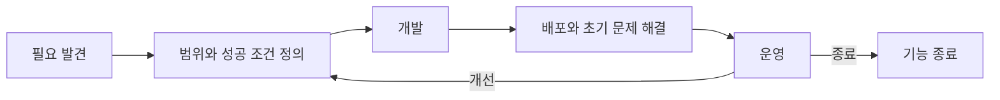
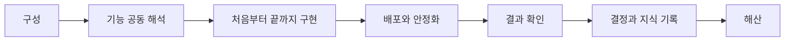
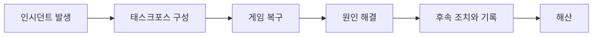
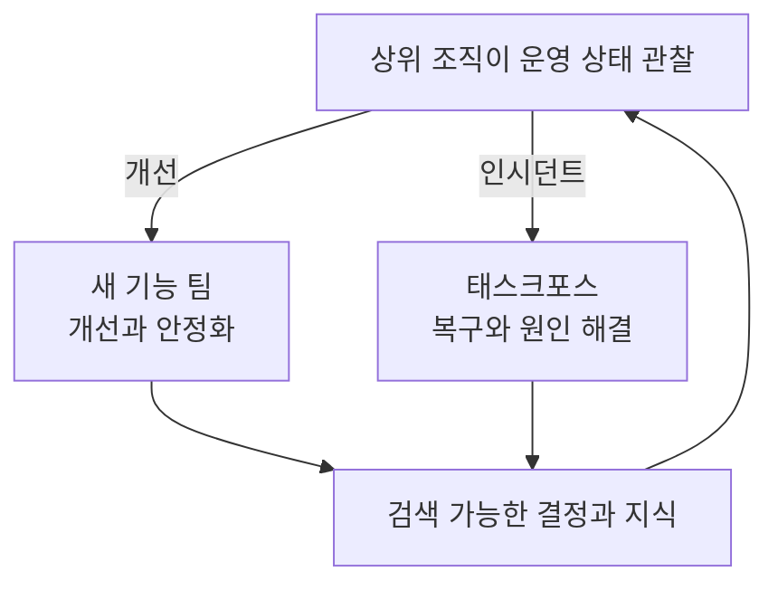
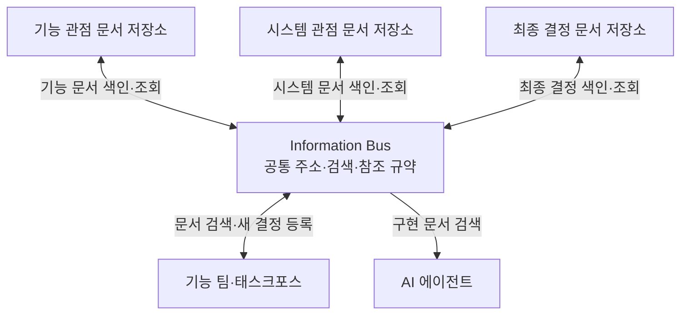
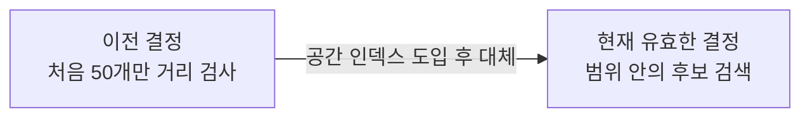
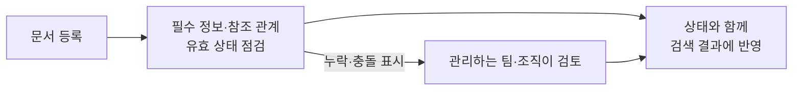

# 들어가며. 에이전틱 코딩은 직무의 경계를 없애는가

게임 프로그래머가 다룰 수 있는 범위가 넓어졌다. 클라이언트와 서버, 게임 로직과 도구 사이의 경계도 전보다 쉽게 넘을 수 있다. 하지만 더 많은 코드를 만든다고 게임 개발 조직 전체가 빠른 속도로 움직이지는 않는다.

이런 변화를 두고 게임플레이·서버·엔진·툴처럼 담당 기술에 따라 프로그래머를 나누는 직함을 없애야 한다는 주장도 나왔다. 기술 경계를 자유롭게 넘을 수 있다면 기능을 직능별로 나누어 구현하기보다 혼자 끝까지 구현하는 편이 훨씬 효율적이라는 논리다.

왜 더 효율적일까? 사람마다 기능을 바라보는 관점이 다르기 때문이다. 기능을 설명할 사람이 늘수록 각자는 자기 관점으로 내용을 다시 해석한다. 혼자 에이전틱 코딩으로 끝까지 구현할 때 유지되던 일관성은 그 과정에서 흐트러진다.

그렇다고 혼자 모든 것을 구현하는 방식이 답은 아니다. 개인의 지식과 스스로 검수할 수 있는 범위에는 한계가 있다. 조직의 목적은 각자의 성과를 극대화하는 데 있지 않다. 서로 다른 관점을 가진 사람들이 협력해 개인의 한계를 넘어서는 결과를 내야 한다.

이 글에서는 어떤 종류의 관점을 제시해야 하는지, 그에 따라 조직의 구조가 어떻게 달라져야 하는지를 다룬다.

이 제안은 게임 개발 조직을 대상으로 한다. 게임과 개발 단계, 기술 구조에 따라 팀의 규모와 조율 방식은 달라질 수 있다. 법률상 역할 분리나 독립적인 승인이 필요한 산업에는 이 구조를 그대로 적용하기 어렵다.

# 1. 같은 게임 요소를 바라보는 다른 관점

MMORPG의 스킬을 예로 들어 관점의 차이를 설명해 보겠다. 플레이어에게 스킬은 특정 조작에 따라 발동하고 그 효과가 몬스터나 다른 플레이어에게 적용되는 기능이다. 이를 구현하려면 기능적 관점과 시스템적 관점에서 서로 다른 결정을 내려야 한다.

## 1.1 기능적 관점: 플레이어 경험에 관한 결정

기능적 관점에서는 스킬이 제공할 플레이 경험을 결정한다. 스킬의 전투 역할과 사용 조건, 대상, 피해량, 부가 효과, 자원 소모량, 재사용 대기시간이 여기에 속한다. 플레이어가 조작한 순간부터 결과를 확인하고 다음 행동을 선택하기까지의 흐름도 함께 설계한다.

## 1.2 시스템적 관점: 구현 방법과 제약에 관한 결정

시스템적 관점에서는 기능적 관점에서 정한 경험을 게임 전체에서 정확하고 안정적으로 구현할 방법을 결정한다. 서버가 클라이언트 입력을 검증하는 방식, 대상 선택과 적중 판정을 처리하는 위치, 네트워크 지연이 생겼을 때 결과를 동기화하는 방식, 버프와 상태 이상이 겹칠 때 적용할 계산 규칙을 정한다. 부정 사용을 막고 전투 기록을 남기는 방법도 결정한다.

같은 스킬이라도 클라이언트·엔진·서버에서는 다른 기술 결정을 내려야 한다. 예를 들어 클라이언트와 엔진에서는 많은 이펙트를 한꺼번에 보여줄 때 생기는 성능 문제를 고려해 표현 방식을 정한다. 서버에서는 구현 방법에 따라 여러 대상에게 영향을 주는 광역 스킬의 대상 검색, 적중 판정, 효과 계산, 결과 전파 방식을 정한다. 이때 개별 스킬뿐 아니라 게임 전체의 일관성도 고려한다.

## 1.3 두 관점을 결합하는 결정

두 관점을 결합하려면 기능적 요구를 구현하는 데 필요한 시스템적 관점을 먼저 골라야 한다. 모든 기능을 클라이언트 성능, 서버 부하, 네트워크 동기화, 보안, 운영의 관점에서 같은 깊이로 검토할 필요는 없다. 기능의 의도와 예상되는 위험을 따져 보고 어떤 관점을 이번 기능의 결정에 반영할지 정한다.

광역 스킬로 많은 대상을 한꺼번에 공격하는 경험을 만들려면 클라이언트와 엔진에서는 이펙트 성능을, 서버에서는 대상 검색과 처리 부하를, 네트워크에서는 결과 전파 방식을 살펴야 한다. 필요한 관점을 고른 뒤에는 타격감을 해치지 않으면서 이펙트를 얼마나 보여줄지, 서버에서 어느 범위까지 대상을 검색하고 판정할지 결정한다. 에이전트에도 시스템 원칙 전체를 나열하기보다 이번 기능에 적용할 관점과 그 이유를 알려야 한다.

# 2. 전달은 재해석이다

같은 스킬을 여러 사람이 나누어 맡으면 기능적 요구사항을 각자의 관점에 따라 해석한다. 담당자는 자신이 아는 기술과 맡은 책임, 과거 경험, 현재 시스템의 제약에 따라 빈 부분을 채운다.

넓은 범위의 많은 적을 공격하는 광역 스킬을 새로 만들어야 한다고 해 보자. 클라이언트 담당자는 한꺼번에 많은 대상에게 이펙트를 보여줄 때 생기는 성능 문제를 먼저 생각한다. 서버 담당자는 넓은 영역에서 스킬에 포함될 대상을 찾을 때 생기는 처리 부하를 먼저 생각한다.

클라이언트 담당자는 성능을 지키려고 한 번에 보여줄 이펙트 수를 제한할 수 있다. 서버 담당자도 부하를 줄이려고 대상 목록에서 앞쪽 30개나 50개의 거리만 검사하도록 제한할 수 있다. 두 제한은 각 담당자가 부하를 줄이려고 추가한 시스템 요구다.

각 담당자는 자신의 관점에서 필요한 결정을 내렸지만 서로가 어떤 제한을 추가했는지는 모를 수 있다. 각자 맡은 부분만 시험할 때는 문제를 찾기 어렵다. 결과물을 합쳐 기능 전체를 실행하는 후반에야 처음에는 없던 두 제한이 스킬의 실제 동작을 바꿨다는 사실이 드러난다. 그때는 이미 마친 구현까지 다시 고쳐야 한다.

이런 차이는 개인의 부주의만으로 설명하기 어렵다. [Keysar 등의 대화 실험](https://pubmed.ncbi.nlm.nih.gov/11228840/)에서는 사람들이 대화 상대와 공유하지 않은 자기 관점을 먼저 사용해 말을 해석하고 이후 공유된 정보로 해석을 고쳤다.

[Carlile의 신제품 개발 연구](https://doi.org/10.1287/orsc.13.4.442.2953)에서는 서로 의존하는 기능 조직마다 지식이 다르게 형성되어 조직 경계에서 문제가 생길 수 있다고 설명한다.

[Kotlarsky 등의 교차 기능 팀 연구](https://doi.org/10.1177/0093650212469402)도 전문 지식이 각자의 상황과 실천에 묶여 있으며 이런 지식 경계가 팀의 지식 조정을 어렵게 할 수 있다고 보고했다. 전달 내용을 더 자세히 적는 것만으로 해석 차이를 없애기 어려운 이유다.

그렇다고 한 사람에게 모든 판단과 구현을 맡기는 것도 답은 아니다. 앞에서 살펴봤듯 개인이 알고 검수할 수 있는 범위에는 한계가 있다. 서로 다른 전문 관점을 유지하면서도 후반의 충돌을 줄이는 방법이 필요하다.

# 3. 검토하기 어려운 에이전틱 코딩

에이전틱 코딩을 사용하면 한 사람이 맡는 구현 범위가 넓어진다. 광역 스킬 하나를 만들 때 클라이언트의 이펙트 처리와 서버의 대상 검색을 각각 다른 사람에게 맡기지 않고 한 사람이 에이전트와 함께 구현할 수 있다.

기능의 의도와 앞에서 내린 결정을 클라이언트와 서버 담당자에게 따로 설명할 일도 줄어든다. 한 사람이 같은 맥락에서 양쪽을 구현하므로 사람 사이에서 생기는 해석 차이와 작업 대기도 줄어든다.

구현 범위가 넓어진 만큼 판단해야 할 범위도 넓어진다. 작업을 넘기는 과정에는 다른 담당자가 질문하고 검토할 기회가 있었다. 이제 조언을 받으려면 구현을 맡은 사람이 먼저 빈틈을 알아차리고 전문가를 찾아야 한다.

자신이 모르는 영역에서는 무엇을 물어야 하는지 알아차리기도 어렵다. 필요한 관점을 빠뜨리면 에이전트는 주어진 판단만 일관되게 구현한다. 그러면 그 사람에게는 일관된 구현처럼 보여도 게임 전체의 시스템 원칙과 어긋날 수 있다.

전문가가 뒤늦게 검토하거나 실제 문제가 생긴 뒤에 차이가 드러난다. 이미 끝낸 구현을 다시 고치느라 생산성이 떨어진다. 기능마다 시스템 판단이 달라지면 게임 전체의 일관성도 흐트러진다.

[METR의 2025년 무작위 실험](https://metr.org/blog/2025-07-10-early-2025-ai-experienced-os-dev-study/)에서는 숙련된 오픈소스 개발자가 당시 AI 도구를 사용할 때 작업 시간이 19% 늘었다. [2026년 후속 실험 자료](https://metr.org/blog/2026-02-24-uplift-update/)에서는 최신 도구가 속도를 높였을 가능성이 나타났다.

표본 선택 편향 때문에 향상 폭은 신뢰하기 어려웠다. AI가 생산성에 미치는 효과는 도구와 과업, 측정 방법에 따라 달라진다. 기능 팀은 코드 작성 속도뿐 아니라 성공 조건을 충족하기까지 걸린 시간과 후반 재작업, 결과의 품질을 함께 살펴야 한다.

작은 기능 팀이 기능의 맥락을 공유하고 완성할 때까지 함께 개발한다. 한 사람은 에이전트와 함께 기능을 처음부터 끝까지 구현한다. 다른 전문가는 각자의 관점에서 제약과 위험을 검토한다. 팀은 검토 결과를 모아 이번 기능에 적용할 시스템 원칙을 정한다.

# 4. 에이전틱 코딩보다 먼저 등장한 슈퍼셀의 셀

슈퍼셀은 작은 독립 팀을 셀이라고 부르고 게임에 관한 결정을 셀에 맡긴다. [공식 문화 설명](https://supercell.com/en/careers/why-you-might-love-it-here/)에서는 출시한 게임과 중단한 게임을 함께 예로 들며 게임의 향방을 게임 팀이 정한다고 밝힌다.

셀 안에서는 동료들이 서로의 판단을 돕는다. 슈퍼셀은 협업하는 구성원에게 팀의 목표를 먼저 생각하고 모르는 것은 질문하며 동료를 돕기를 기대한다. 구성원은 각자의 전문성을 팀의 결정에 보태고 그 결과를 함께 책임진다.

셀의 구성원은 기능 단위로 협업한다. 슈퍼셀의 [Brawl Stars 게임 프로그래머 채용 설명](https://supercell.com/en/careers/senior-game-programmer-brawl-stars/0f4bafd3-2221-462a-87a7-0959d02ffc08/)에 따르면 디자이너와 아티스트, 프로그래머는 막연한 아이디어를 완성된 구현으로 만들 때까지 함께 일한다. 게임 프로그래머는 기능을 처음부터 끝까지 구현하고 게임에서 필요한 여러 영역을 다루는 제너럴리스트로 일한다.

게임 프로그래머는 여러 기술 영역을 직접 다루면서 기능 구현에 필요한 결정을 팀원들과 함께 내린다. 디자이너와 아티스트는 플레이 경험과 표현을, 프로그래머는 구현과 시스템의 관점을 보탠다. 서로의 판단을 같은 기능에 적용하면서 구현과 검토를 함께 진행한다.

슈퍼셀은 여러 셀이 함께 쓰는 기술을 중앙 Game Tech 조직에 맡긴다. [Titan 엔진을 소개한 공식 자료](https://supercell.com/en/news/game-engine-called-titan/)에 따르면 Game Tech는 자체 게임 엔진과 공통 서비스 플랫폼, 클라우드·보안·AI 계층을 담당한다. 게임 팀은 검증된 구성 요소를 사용해 플레이어가 경험할 기능에 집중한다.

게임 팀은 필요한 기술을 스스로 선택한다. Game Tech는 선택할 만한 도구와 서비스를 만들고 여러 셀이 이를 함께 쓴다. 게임에 관한 결정은 셀이 내린다.

셀의 크기와 운영 방식은 게임 단계에 따라 달라진다. 슈퍼셀 CEO Ilkka Paananen은 [2024년 조직을 설명한 글](https://supercell.com/en/news/comfortable-feeling-uncomfortable/)에서 셀의 구조를 바꾸겠다고 밝혔다. 새 게임 팀은 작은 창업팀처럼 빠르게 시험하고 플레이어 반응을 확인한다. 라이브 게임 팀은 콘텐츠와 운영에 필요한 직능을 더해 게임 유닛으로 커진다.

슈퍼셀은 에이전틱 코딩이 등장하기 전부터 작은 다기능 팀에 결정권을 주었다. 구성원은 기술 경계를 넘었고 공통 기술 조직은 여러 팀을 지원했다. 에이전틱 코딩으로 한 사람이 맡는 구현 범위가 넓어진 지금, 다음 절에서는 이 사례를 바탕으로 기능 팀, 전문가 커뮤니티, 어드바이저의 협업 방식을 제안한다.

# 5. 기능 팀이 주도하는 기능 개발

앞에서 다룬 광역 스킬을 만든다고 해 보자. 이 기능에는 스킬의 역할과 밸런스를 정할 사람, 이펙트와 애니메이션을 만들 사람, 클라이언트 성능과 서버의 대상 검색을 검토할 사람, 여러 전투 조건에서 결과를 검증할 사람이 필요하다. 게임 조직은 광역 스킬을 만들 기능 팀을 꾸린다.

팀의 인원수는 역할 수와 같을 필요가 없다. 에이전틱 코딩으로 한 사람이 클라이언트와 서버 구현을 함께 맡을 수 있고 다른 구성원도 여러 역할을 겸할 수 있다. 기능 팀은 범위와 성공 조건, 적용할 시스템 판단을 함께 정하고 스킬이 의도대로 동작할 때까지 기능을 책임진다.

광역 스킬 팀은 플레이어가 넓은 범위의 적을 공격하고 적중 결과를 확인하는 데 필요한 클라이언트 구현, 서버 처리, 이펙트 제작과 검증을 모두 맡는다.

성능 때문에 이펙트 수와 서버의 대상 검색 범위를 조정해야 한다면, 팀이 두 문제를 같이 검토한다. 플레이어가 공격 범위와 적중 결과를 알아볼 수 있도록 표현과 처리 방식을 조정한다.

기능 팀은 광역 스킬의 목적과 범위를 정하고 클라이언트와 서버, 데이터와 이펙트를 연결해 배포한다. 배포한 뒤에는 실제 전투에서 스킬이 의도한 역할을 하는지 확인한다. 프레임 저하나 대상 누락, 이펙트 식별 문제처럼 초기에 드러난 문제도 같은 팀이 고친다.

한 사람이 에이전트와 함께 구현 대부분을 맡았더라도 합의한 성공 조건을 충족했는지, 초기 문제가 정리됐는지는 팀이 판단한다.

에이전틱 코딩은 제너럴리스트가 맡는 구현 범위를 넓힌다. 한 사람은 팀이 합의한 판단을 에이전트에 제공하고 클라이언트와 서버를 가로질러 코드를 완성한다. 다른 구성원은 자기 전문 영역에서 빠진 제약과 위험을 찾고 기능에 적용할 판단을 함께 정한다.

전문가는 모든 구현을 직접 맡지 않아도 기능에 자신의 판단을 반영할 수 있다. 구현 초기에 빠진 제약과 위험을 짚고 개발 중에 결정이 달라질 때도 함께 검토한다.

Riot Games의 리그 오브 레전드 챔피언 팀도 챔피언 하나를 만들기 위해 여러 직능을 한 팀에 모았다. [2018년 공식 개발 글](https://www.riotgames.com/en/work-with-us/disciplines/dev-management/dont-go-chasing-waterfall-using-agile-methods-in-creative-development)에 따르면 디자이너, 작가, 아티스트, 엔지니어, QA, 프로듀서 등 14개 직능이 한 목표 아래 챔피언의 초기 발견부터 출시 전 검증까지 함께 개발했다.

아이번을 개발할 때 팀은 챔피언의 제품 비전을 공통 기준으로 삼고 작은 변경이 애니메이션과 스킬 이펙트, 사운드에 미치는 영향을 계속 공유했다. 실제 게임에서 함께 플레이한 뒤 챔피언 전체가 제품 목표에 맞는지도 살폈다.

광역 스킬을 배포하고 초기 문제까지 해결하면 구성원은 다른 기능 팀에 합류한다. 장기 운영은 게임을 담당하는 상위 조직이 맡는다. 기능은 팀이 해산한 뒤에도 계속 운영되므로 기능 팀을 고정 부서로 둘 필요는 없다. 다음 절에서는 기능과 기능 팀의 생애주기를 나누어 이 구조가 필요한 이유를 설명한다.

# 6. 기능은 지속적으로, 기능 팀과 태스크포스는 임시로

## 6.1 기능의 생애주기

먼저 기능의 범위와 성공 조건을 정한다. 개발과 배포를 마치고 초기 문제를 해결하면 운영을 시작한다. 운영 중 개선이 필요해지면 범위와 성공 조건을 다시 정한다. 기능을 유지할 이유가 사라지면 종료한다.

## 6.2 기능 팀의 생애주기

조직은 기능에 필요한 관점을 검토해 팀을 구성한다. 구성원은 기능의 범위와 성공 조건, 적용할 시스템 판단을 함께 정한 뒤 기능을 처음부터 끝까지 구현한다.

코드를 모두 작성했다고 팀을 해산하지 않는다. 배포한 기능이 성공 조건을 충족하고 초기 문제가 정리됐는지 확인한 뒤 결정과 시행착오를 기록한다. 여기까지 마치면 구성원은 다른 기능 팀에 합류한다.

## 6.3 인시던트 태스크포스의 생애주기

상위 조직은 인시던트가 발생하면 현재 문제에 필요한 관점과 권한을 가진 사람들로 태스크포스를 꾸린다. 이전 기능 팀의 구성원이 모두 참여할 필요는 없다.

태스크포스는 먼저 게임을 정상 상태로 복구하고 원인을 해결한다. 재발 방지 조치와 결정 사항을 기록한 뒤 해산한다.

## 6.4 상위 조직의 운영주기

상위 조직은 기능 팀과 태스크포스가 해산한 뒤에도 운영 상태를 관찰한다. 개선이 필요하면 새 기능 팀을 꾸리고 인시던트가 발생하면 태스크포스를 꾸린다.

각 팀은 해산하기 전에 결정 사항을 기록한다. 새로 모인 구성원은 기능의 범위와 시스템 판단, 시행착오와 후속 조치를 검색해 과거 맥락을 확인한다. 결정이 바뀐 순서와 현재 유효한 내용을 기록에 남긴다.

# 7. 조직이 공유하는 전문성

기능 팀은 필요한 전문 정보를 네 경로에서 얻는다. 전문가 커뮤니티는 사례와 판단 기준을, 공통 플랫폼은 실행 가능한 도구를, 테크니컬 어드바이저는 기능에 맞춘 조언을, 회사 공통 제약 담당 조직은 의무와 위험을 전달한다.

## 7.1 전문가 커뮤니티: 사례와 판단 기준을 공유한다

광역 스킬 팀은 서버의 대상 검색 범위와 성능 측정 결과, 선택한 제한과 이유를 문서에 남긴다. 다른 기능 팀은 비슷한 문제를 다룰 때 이 정보를 검색하고 부족한 내용은 커뮤니티에 질문한다.

전문가 커뮤니티는 여러 기능 팀이 남긴 질문과 답변, 실패 사례, 위험, 용어를 정리해 문서와 체크리스트, 권장 패턴, 참고 구현으로 만든다. 기능 팀은 이 자료를 참고해 결정한다. 커뮤니티에는 승인이나 심사 권한이 없다.

## 7.2 공통 플랫폼: 반복되는 좋은 판단을 실행 가능한 경로로 만든다

공통 플랫폼은 여러 기능 팀에 반복해서 필요한 구현을 코드와 도구로 제공한다. 광역 스킬 팀은 서버의 공통 영역 검색 기능으로 대상 후보를 찾는다. 클라이언트의 이펙트 예산 관리 도구로 한 번에 표시할 양도 측정한다.

대상 범위와 이펙트 표현은 기능 팀이 정한다. 플랫폼은 측정 방법과 선택 가능한 기본값을 셀프서비스로 제공하고 현재 유효한 필수 제약만 자동으로 검사한다. 공통 엔진과 빌드·배포·데이터·라이브 운영 도구도 같은 방식으로 제공한다.

## 7.3 테크니컬 어드바이저: 기능의 맥락에 전문 판단을 연결한다

광역 스킬 팀이 대상 검색 범위와 이펙트 표현을 정할 때 서버와 클라이언트 어드바이저가 관련 사례와 위험을 제공한다. 구현이 굳은 뒤 문제를 발견하면 양쪽 코드를 다시 고쳐야 하므로 기능과 시스템을 결합하는 초기에 참여한다.

어드바이저는 선택지와 위험을 설명하고 기능 팀이 놓친 질문을 제시한다. 기능 팀이 최종 선택을 내리면 적용 결과를 확인해 조언과 함께 기록한다. 여러 팀에서 같은 위험이 반복되면 다음 팀이 묻기 전에 관련 정보를 전달한다.

## 7.4 회사 공통 제약 담당 조직: 의무와 광범위한 위험을 명확히 한다

플레이어가 광역 스킬을 사용하면 서버는 넓은 범위의 대상을 계산하고 클라이언트는 많은 화면 효과를 표시한다. 보안 담당 조직은 위조 입력이나 과도한 호출로 서버 부하를 일으킬 수 있는 위험과 반드시 지켜야 할 검증 조건을 설명한다.

안전 담당 조직은 많은 이펙트를 동시에 보여줄 때 생길 수 있는 광과민성 위험과 적용할 기준을 설명한다. 법률과 개인정보 담당 조직은 이 기능에 적용되는 의무가 있을 때 참여한다.

공통 제약 담당 조직은 기능의 범위와 처리 방식을 정하는 초기에 적용 의무와 최소 조건, 예상 피해를 전달한다. 기능 팀은 이를 충족할 방법을 조율한 뒤 최종 구현을 결정한다. 권장 사항과 법적·계약상 의무도 구분해 전달한다.

# 8. 유동적인 조직을 위한 기반 시설

광역 스킬을 개선할 새 기능 팀이 꾸려졌다고 해 보자.

개선 도중 서버가 탐색한 범위 안의 대상 중 처음 50개만 거리를 검사하도록 제한했다는 사실을 발견한다. 문서나 주석에 이유가 없어 이전 서버 담당자에게 연락한다.

이전 담당자는 맥락을 설명하는 데 시간을 쓰고 새 기능 팀은 이를 이해하는 데 시간을 쓴다. 때로는 설명할 시간에 이전 담당자가 직접 고치는 편이 빠르다.

이런 일이 반복되면 특정한 사람이 특정한 기능만 개발하는 구조가 굳어진다. 유동적인 기능 팀은 개발 시간을 더 쓰는 천덕꾸러기 취급을 받는다.

유동적인 조직이 제대로 동작하려면 기능에 관한 지식과 결정 사항을 새 팀이 이전 담당자 없이 찾을 수 있어야 한다. 이 절에서는 에이전틱 코딩 시대의 유동적인 조직에 필요한 기반을 설명한다.

## 8.1 구현에 필요한 결정을 문서로 남긴다

에이전틱 코딩으로 기능을 구현하려면 목적과 범위, 성공 조건, 적용할 시스템 판단을 에이전트에게 문서로 제공해야 한다. 구현에 반영할 결정도 같은 문서 체계 안에 남긴다.

기능 관점 문서에는 플레이어에게 제공할 동작과 성공 조건을 기록한다. 시스템 관점 문서에는 서버·클라이언트·엔진·보안 등에서 고려할 제약과 선택지를 기록한다. 전문가의 조언도 관련 시스템 관점 문서에 반영한다.

기능 팀은 어떤 기능 요구에 어떤 시스템 판단을 적용할지 결정하고 그 결과를 최종 결정 문서에 남긴다. 이 문서에는 관련 기능 관점 문서와 시스템 관점 문서를 링크한다. 채팅에서 나온 질문과 답변도 관련 문서에 정리한다.

광역 스킬의 기능 관점 문서에는 영향받을 대상과 적용할 효과를 기록한다. 서버 시스템 관점 문서에는 넓은 영역을 검색할 때의 부하와 후보 수를 제한하는 방법을, 클라이언트 시스템 관점 문서에는 많은 이펙트를 표시할 때의 성능 문제를 기록한다.

기능 팀은 두 문서를 함께 검토해 대상 선정 방식과 서버의 검사 범위, 클라이언트의 이펙트 표현을 결정한다. 선택의 맥락과 이유, 적용 결과는 최종 결정 문서에 남기고 에이전트용 구현 문서에서 이를 참조한다.

## 8.2 정보 버스

문서를 작성해도 저장소와 조직마다 흩어져 있으면 새 기능 팀이 필요한 판단을 찾기 어렵다. 담당자를 알거나 정확한 문서 이름을 알아야 검색할 수 있다면 이전 담당자에 대한 의존은 사라지지 않는다.

컴퓨터의 I/O 버스에는 종류가 다른 장치가 같은 통로와 규약으로 연결된다. 각 장치는 정해진 주소와 신호 형식을 사용하므로 장치가 추가되어도 나머지 장치와 일대일 연결을 새로 만들 필요가 없다.

이 글에서는 이런 공통 연결 방식을 정보 버스(information bus)라고 부르겠다. 정보 버스는 기능 관점 문서와 시스템 관점 문서, 최종 결정 기록을 공통 주소와 검색·참조 규약으로 연결한다. 기능 팀과 태스크포스는 같은 경로로 정보를 등록하고 검색한다. AI 에이전트도 구현에 필요한 문서를 이 경로에서 찾는다.

각 조직은 기존 저장소에서 문서를 관리한다. 정보 버스는 기능 이름, 시스템 관심사, 문서 종류, 참조 관계, 결정의 유효 상태를 공통 형식으로 색인한다. 기능 팀의 최종 결정 문서가 기능 관점 문서와 시스템 관점 문서를 연결하면 그 참조 관계도 검색 대상에 포함한다.

광역 스킬을 검색하면 대상과 효과를 정한 기능 관점 문서에서 서버의 대상 검색, 클라이언트의 이펙트 성능, 네트워크 전파, 보안 검증에 관한 시스템 관점 문서로 이동할 수 있다. 서버의 대상 검색을 기준으로 검색하면 다른 기능에서 내린 관련 결정도 찾을 수 있다.

같은 주제의 결정이 여러 개라면 현재 유효한 결정을 먼저 보여준다. 근거 문서와 이전 결정도 여기서 이어서 살펴본다.

새 기능 팀과 인시던트 태스크포스는 이전 구성원을 다시 부르지 않고 기능의 맥락과 적용할 시스템 판단을 확인한다. AI 에이전트도 같은 주소와 참조 관계로 구현에 필요한 문서를 찾는다.

## 8.3 결정의 변경 이력을 시간순으로 관리한다

같은 주제의 결정이 여러 문서에 남으면 어느 결정을 따라야 하는지 알기 어렵다. 최종 결정 문서에는 적용할 기능과 시스템 관심사, 적용 시점과 범위, 현재 상태를 기록한다. 새 결정에는 어떤 결정을 대체했는지도 기록한다.

광역 스킬 팀은 서버 부하를 줄이기 위해 대상 목록의 처음 50개만 거리를 검사하기로 결정했다. 이후 공통 플랫폼에 공간 인덱스가 도입되자 새 기능 팀은 이 제한을 없애고 범위 안의 후보를 공간 인덱스로 검색하기로 결정한다.

새 기능 팀은 이전 결정을 대체한다는 사실과 변경 이유, 성능 측정 결과를 새 문서에 기록한다. 이전 결정도 변경 이력으로 보존한다. 정보 버스는 광역 스킬과 서버 대상 검색에 관해 가장 최근에 내린 유효한 결정을 먼저 보여준다.

결정의 유효성은 작성 시점과 적용 범위, 대체 관계를 함께 따져 정한다. 이전 버전이나 다른 게임 모드에는 과거 결정이 여전히 적용될 수 있다. 필요한 사람은 현재 결정을 먼저 확인한 뒤 이전 결정과 변경 이유를 시간순으로 살펴볼 수 있다.

## 8.4 시스템이 문서 관리의 누락을 표시한다

기능 팀과 태스크포스는 작업을 마치면 해산한다. 문서 관리가 구성원의 주의력에만 의존하면 참조 링크와 적용 범위가 빠지거나 대체된 결정이 현재 상태로 남을 수 있다. 새로운 팀이 꾸려질 때마다 같은 문제가 반복된다.

정보 버스는 문서를 등록할 때 기능과 시스템 관심사, 적용 범위, 현재 상태, 근거 문서, 이전 결정과의 대체 관계를 확인한다. 필수 정보의 누락과 끊어진 참조, 같은 범위에 복수로 남은 유효 결정, 검토 시점이 오래된 기록을 표시한다.

새 결정이 대체한 이전 결정을 연결하지 않았다면 누락을 표시한다. 같은 범위에서 둘 이상의 결정이 모두 현재 유효하다고 기록되어 있으면 충돌을 표시한다.

기능 팀이 활동하는 동안에는 기능 관점 문서와 최종 결정 문서가 여전히 유효한지 판단한다. 팀이 해산한 뒤에는 상위 게임 조직이 두 문서를 관리하다가 새로운 기능 팀에 인계한다.

전문가 커뮤니티와 공통 플랫폼, 회사 공통 제약 담당 조직은 각자 관리하는 시스템 관점 문서를 검토한다. 정보 버스는 이 판단에 따라 검색 결과의 상태를 갱신한다.

정보 버스는 필수 정보와 참조 관계만 확인한다. 내용의 타당성을 자동으로 판정하거나 별도의 승인 절차를 추가하지 않는다. 기능 팀의 결정이 늦어지는 것을 막기 위해서다.

# 9. 최종 결정은 기능 팀이

광역 스킬의 서버 부하를 줄이는 방법을 두고 어드바이저의 의견이 갈릴 수 있다. 한 사람은 대상 목록에서 처음 50개만 검사해 기능을 먼저 출시하자고 제안한다. 다른 사람은 대상 누락이 기능의 의도를 바꿀 수 있으므로 공간 인덱스를 먼저 구현하자고 제안한다.

기능 팀은 대상 수를 제한해 먼저 출시할지, 공간 인덱스를 구현한 뒤 출시할지 정해야 한다. 광역 스킬의 성공 조건과 일정, 감수할 위험을 함께 검토한다. 범위 안의 모든 대상에게 효과를 적용하기로 했다면 공간 인덱스를 먼저 구현하고 대상 수 제한은 적용하지 않을 수 있다.

어드바이저는 각 선택의 비용과 위험, 과거 사례를 설명한다. 팀은 어떤 조언을 먼저 적용하고 무엇을 적용하지 않을지 결정한다. 따르지 않은 조언과 그 이유, 감수하기로 한 위험은 최종 결정 문서에 남긴다. 적용한 결정의 결과도 확인한다.

# 10. 각자의 전문성은 서로를 돕는 데 쓰인다

에이전틱 코딩을 사용하면 한 사람이 클라이언트 로직과 서버 처리, 엔진 코드와 개발 도구를 함께 수정할 수 있다. 기능을 구현할 때 기술 영역을 나눌 필요도 줄어든다.

각자가 쌓아온 전문성은 다른 구성원의 구현을 돕는 데 쓰인다. 서버 경험이 많은 사람은 대상 검색에서 생길 부하를 짚어 줄 수 있다. 클라이언트와 엔진 경험이 많은 사람은 여러 이펙트를 동시에 보여줄 때 생기는 문제를 미리 알려 줄 수 있다.

조언을 받은 구성원은 자신에게 익숙하지 않은 영역의 판단까지 에이전트에 제공해 기능 전체를 구현한다. 모든 구성원이 모든 분야의 전문가가 될 필요는 없다. 기능 팀은 기능 전체를 맡고 팀원들은 각자 잘 아는 영역에서 다른 구성원의 판단을 돕는다.

기능 팀이 기능 전체를 맡으려면 이를 뒷받침하는 기술 구조도 필요하다. 공통 시험 도구로 광역 스킬의 클라이언트와 서버 변경을 기능 단위로 검증한다. 변경 사항은 제한된 범위에 단계적으로 배포하고 문제가 생기면 이전 상태로 되돌린다.

공유 엔진이나 전투 서버, 결합도가 높은 레거시를 수정하면 여러 기능에 영향을 줄 수 있다. 검증 비용이 큰 변경도 있다. 이때는 관련 전문가와 플랫폼 팀이 더 일찍 참여해 변경 순서와 시험 범위를 함께 정한다. 기능 팀은 전체 결과를 맡되 조율 시점을 앞당긴다.

# 맺으며. 새로운 토대 위에 쌓는 협력

그동안 조직은 작업자 사이의 전달과 검토를 거쳐 기능을 구현했다. 에이전틱 코딩으로 한 사람이 맡는 범위가 넓어지면서 작업을 다른 사람에게 넘길 일이 줄었다. 사람 사이의 직접적인 협력과 질문, 검토도 함께 줄었다.

직접적인 협력이 줄어든 이유를 개인의 협업 의지나 에이전틱 코딩의 우월성에서 찾으면 무엇을 바꿔야 하는지 알 수 없다. 이전에는 작업을 넘길 때 다른 담당자의 질문과 검토가 자연스럽게 따라왔다. 이제는 한 사람이 기능 전체를 구현하면서 그런 계기가 사라졌다.

조직은 필요한 관점이 기능 팀에 도달하도록 새로운 소통 방식을 설계해야 한다. 전문성은 여러 경로로 공유한다. 그 과정에서 만든 기록은 정보 버스에서 찾을 수 있게 한다. 기능 팀은 이번 기능에 적용할 판단을 골라 기록한다.

이 기반 위에서 기능은 수직으로 끝까지 다루고, 전문성은 수평으로 필요한 곳에 전달할 수 있다.
