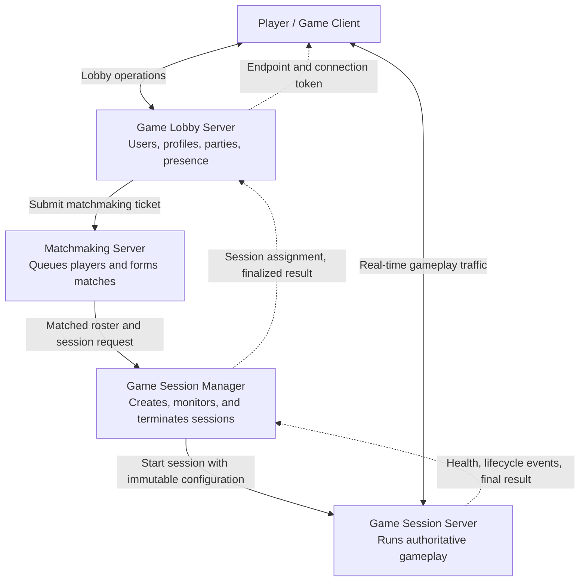

## Why I Started This Project

[GitHub Link](https://github.com/jinunpark/brawl-stars-copy)

I started this project to find out whether I could build a game server with an AI agent.

Many projects implement asynchronous network engines or game-server frameworks. However, I could not find one that implemented the requirements of a complete game server.

I deliberately based the project on Brawl Stars, a popular game with short, straightforward matches and several interesting mechanics.

As an action game, Brawl Stars also provides a useful test case for synchronization logic.

## Technical Design

Each Brawl Stars match lasts less than three minutes. Matches are independent, and only their results need to be stored persistently.

To support this model, I assumed the following backend architecture:



### Game Session Lifecycle

This architecture imposes three requirements on the game session server:

- A session starts with a fixed number of players.
- Once a session ends, its server instance is not reused.
- Explicit rules define when a session starts and ends within its three-minute lifetime.

### Synchronization Model

Brawl Stars includes bushes that hide characters from their enemies. This mechanic led me to use snapshot-based synchronization. 

Inspired by Valorant, the server does not send a hidden character's snapshot to enemy players.

The server runs at 30 Hz. During each tick, it:

- Gathers client input
- Processes all input and game logic together
- Distributes the resulting state at the end of the tick

### Multithreading Model

Multithreading is the backbone of the server. It shapes how gameplay is implemented and is difficult to change later.

I learned this lesson from [a talk at the Nexon Developers Conference](https://ndcreplay.nexon.com/NDC2018/sessions/NDC2018_0075.html).

I defined three principles for multithreading:

- Packet processing must not block game-logic processing.
- One client must not disrupt the entire game.
- The design must allow game logic to run across multiple threads in the future.

The detailed thread architecture is documented [here](https://github.com/jinunpark/brawl-stars-copy/blob/main/adrs/001-asynchronous-role-owned-server-runtime.md).

## How I Worked with the AI Agent

I had three goals for working with the AI agent:

- Avoid spending long periods fixing defects
- Preserve consistency when starting a new conversation
- Minimize the number of decisions the agent asks me to make during implementation

I followed two principles to support those goals:

- Write implementation plans in as much detail as possible
- Be willing to start over when the output differs substantially from my expectations

### Workflow

My workflow combined four skills:

- Use [Wayfinder](https://github.com/mattpocock/skills/blob/main/skills/engineering/wayfinder/SKILL.md) to build the plan
- Use [To Goal](https://github.com/jinunpark/personal_skills/blob/main/plugins/goal-loop/skills/to-goal/SKILL.md) to divide the plan into goals
- Use [Choose Goal and Run](https://github.com/jinunpark/personal_skills/blob/main/plugins/goal-loop/skills/choose-goal-and-run/SKILL.md) to select the latest goal and run it to completion
- Use [ATDD Implementation Loop](https://github.com/jinunpark/personal_skills/tree/main/plugins/goal-loop/skills/atdd-implementation-loop/SKILL.md) to implement the goal

I enjoy writing adversarial acceptance tests at the start of implementation. They provide a strong harness for loop engineering because mocked implementations cannot falsely satisfy them.

This approach depends on clearly defined completion criteria for every goal. Wayfinder helped me establish those criteria.

### Working with Milestones

I used milestones to keep the agent focused on the current context.

When preparing a new plan, the agent reads all previous milestone documents. During implementation, it reads only the document for the current milestone.

The project has four milestones:

- Build a basic gameplay prototype
- Define the game mode and its rules
- Move the client to the Godot engine
- Make the game server multithreaded and asynchronous

### Memorable Steering Decisions

The agent narrates its approach and decisions as it works. I read as much of this as possible so I can intervene when its direction differs from my intent.

While planning a refactor of the game loop, I found several issues and steered the agent toward the design I wanted.

I used two kinds of steering:

- Choosing an option that differed from the agent's recommendation
- Agreeing with the recommendation while adding context to clarify my intent

Both were effective. LLMs tend to focus on the most recent issue, so timely steering prevents the agent from drifting toward an unrelated solution.

Two steering decisions were particularly memorable.

The conversation excerpts below are reproduced verbatim.

#### Defining Ownership at Queue Insertion

Why was this important?

- Every thread has its own queue for incoming requests.
- Ownership must be defined when a message crosses a thread boundary.
    - This allows garbage collection to work correctly.
    - It allows messages to be discarded when a session ends or shuts down.
- The discussion determined which module owns an item once it enters the queue.

The agent's question and recommendation:

```
Next decision: who owns a codec attempt when queue submission returns `SATURATED` or `NOT_ACCEPTING`?

My recommendation: ownership never transfers to the codec.

- The connection owner retains the operation or payload.
- It permanently records that `CodecAttemptId` as rejected.
- `SATURATED` may later retry the same operation with a fresh attempt ID.
- `NOT_ACCEPTING` settles without retry because shutdown has closed admission.
- The codec pipeline may expose the rejection result, but must not claim that it owned or discarded unaccepted work.

Do you approve producer ownership for rejected submissions?
```

My response:

```
Recommendation for SATURATED is right.
But NOT_ACCEPTING is sent to the queue but codec didn't accepted.
I think queue has ownership if connection put a payload to queue, doesn't it?
```

#### Clarifying Session Termination

Why was this important?

- The game session server could be reused after a session ended.
- Objects that survived termination could cause memory leaks.
- I chose to send a termination message through the queue to keep the input flow uniform.

The agent's question and recommendation:

```
Next question: where should that notice wait while accepted snapshots drain?

I recommend storing exactly one terminal notice separately from the five waiting snapshot slots:

- Stop accepting new snapshots for that connection.
- Drain its already accepted snapshots.
- Write the terminal notice next.
- Close after its delivery outcome.
- Do not let the terminal notice itself cause queue overflow.

Do you accept this separate terminal-notice position?
```

My response:

```
We don't need to prepare separate room for terminal notice.
Snapshot slots should be emptied when session is ended.
Please regard slots as "sending queue", not "snapshot slot".
```

## Future Improvements

Despite the detailed planning, I still had to intervene often during implementation. That is the main reason of implementation went slow.

To make the agent more autonomous, I plan to:

- Find a better way to define completion criteria
- Adopt a system for managing decisions
- Use LSP (Language Server Protocol) to reduce token usage

Many tasks remain before the project doesn't implement a complete game architecture yet:

- Support multiple game modes
- Build a map editor
- Improve the client
- Implement the lobby, matchmaking, and session-manager servers
