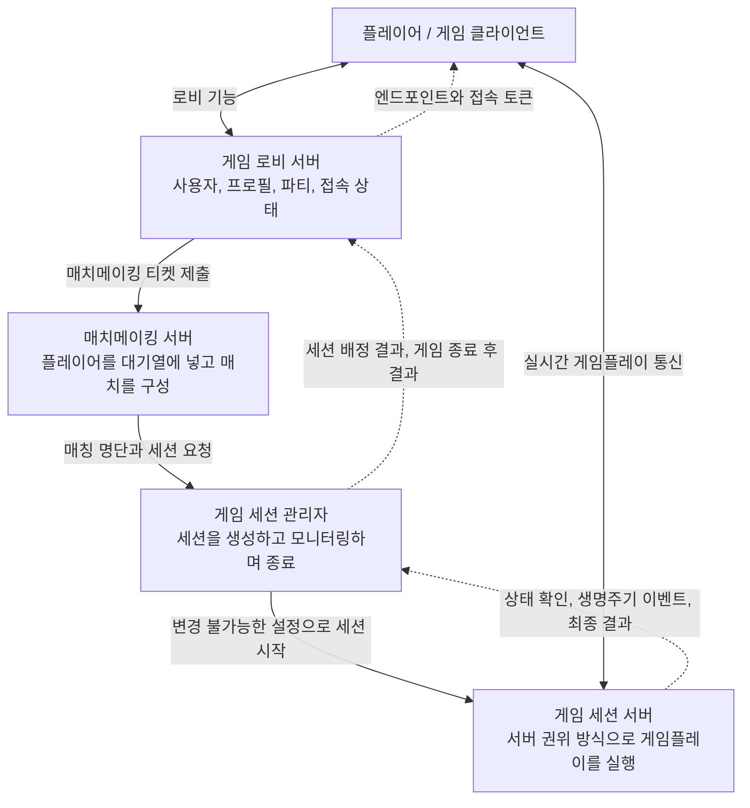

## 왜 만들었나

[GitHub Link](https://github.com/jinunpark/brawl-stars-copy)

개인적으로 영어 공부를 위한 프로그램을 만들면서, 게임 서버를 AI 에이전트로 만들 수 있겠다는 생각이 들었다.
공개된 코드 중에 비동기 네트워크 엔진 또는 게임 서버 엔진을 만드는 프로젝트는 많았지만, 실제 게임 서버의 요구사항을 구현하는 프로젝트는 내가 아는 한에는 없었다.

게임 제작 코드는 보통 공개하지 않는다. 외부에 나가지 않는 서버 코드는 더더욱 그렇다.
때문에 인기 있는 게임인 [브롤 스타즈](https://supercell.com/en/games/brawlstars/)의 공개된 구현 요구사항을 바탕으로 게임을 구현해 보았다.
브롤 스타즈는 간단하고 짧은 게임이고, PvP 슈터 게임이 가지고 있는 여러 흥미로운 요구사항을 구현하고 있다.
때문에 동기화 로직이나 멀티스레딩 로직들을 구현하기에 좋은 예라고 생각했다.

## 목표

브롤스타즈의 한 세션은 3분이 채 되지 않을 정도로 매우 짧다. 플레이는 세션 단위로 분리되며 결과만 영구적으로 저장된다.

전체 백엔드 시스템 아키텍처는 이렇게 가정했다.



### 게임 세션 생명주기

위 아키텍처에서 게임 세션 서버가 신뢰성 있게 동작하려면 세 가지 요구사항을 만족해야 한다.

- 게임 세션은 정해진 수의 사용자로 시작한다.
- 종료된 게임 세션은 재사용하지 않는다.
- 세션이 3분 안에 끝나므로 시작과 종료 조건을 명확하게 정의해야 한다.

### 동기화 방식

브롤스타즈에는 캐릭터를 적에게 보이지 않게 만드는 요소인 수풀이 있다.
이 요소 때문에 스냅샷을 동기화하는 방식을 사용해야 한다. 발로란트의 동기화 방식과 같이, 숨어 있는 캐릭터의 스냅샷은 적에게 동기화하지 않는다.

서버는 30Hz 틱으로 실행한다. 각 틱에서는 다음 작업을 수행한다.

- 클라이언트 입력 수집
- 모든 입력과 로직을 한 번에 처리
- 틱이 끝날 때 상태 배포

### 멀티스레딩 방식

멀티스레딩 방식은 시스템의 뼈대와 같다. 게임플레이를 구현하는 방식을 결정하며 나중에 바꾸기도 쉽지 않다. [이승재님의 NDC 발표](https://ndcreplay.nexon.com/NDC2018/sessions/NDC2018_0075.html)에서 이 점을 배웠다.

게임 플레이를 위한 멀티스레딩 원칙은 다음과 같다.

- 패킷 처리가 게임 로직 처리를 방해하지 않도록 한다.
- 클라이언트와의 연결 과정에서 생긴 문제가 게임 전체에 영향을 주어서는 안 된다.
- 게임 로직을 여러 스레드에서 실행하는 구조로 바꾸기 쉬워야 한다.

스레드 아키텍처의 자세한 설계는 [여기](https://github.com/jinunpark/brawl-stars-copy/blob/main/adrs/001-asynchronous-role-owned-server-runtime.md)에 정리했다.

## AI와 협업하는 방식

AI와 협업할 때 세 가지를 목표로 삼았다.

- 결함 수정에 오랜 시간을 쓰는 상황 방지
- 새로운 대화 세션을 시작해도 일관성 유지
- 코딩 작업 중에 에이전트가 결정을 묻는 횟수 최소화

이를 실천할 원칙 두 가지를 세웠다.

- 구현 계획 문서를 가능한 한 자세하게 작성한다.
- 결과가 기대와 크게 다르면 처음부터 다시 만드는 방안을 적극적으로 고려한다.

### 주요 작업 과정

작업은 네 단계로 진행했다.

- [Wayfinder](https://github.com/mattpocock/skills/blob/main/skills/engineering/wayfinder/SKILL.md) 스킬로 계획 문서 작성
- [To Goal](https://github.com/jinunpark/personal_skills/blob/main/plugins/goal-loop/skills/to-goal/SKILL.md) 스킬로 계획 문서를 여러 목표로 분할
- [Choose Goal and Run](https://github.com/jinunpark/personal_skills/blob/main/plugins/goal-loop/skills/choose-goal-and-run/SKILL.md)으로 최신 목표를 선택하고 완료할 때까지 실행
- [ATDD Implementation Loop](https://github.com/jinunpark/personal_skills/tree/main/plugins/goal-loop/skills/atdd-implementation-loop/SKILL.md)로 구현

나는 적대적 인수 테스트(adversarial acceptance test)를 구현의 시작점으로 작성한다. 이렇게 하면 구현 코드에 영향 받지 않는 테스트를 작성할 수 있어, 루프 엔지니어링을 위한 강력한 하네스가 된다.

다만 이 방식에는 목표의 완료 조건을 반드시 설명해야 한다는 강한 전제가 있다. Wayfinder 스킬이 완료 조건을 엄밀하게 만드는 데 많은 도움을 주었다.

### 마일스톤을 활용한 작업

에이전트가 현재 맥락에 집중하도록 마일스톤을 설정했다. 에이전트는 새로운 계획 문서를 만들 때 이전 마일스톤을 모두 읽고, 구현할 때는 현재 마일스톤 문서만 읽도록 했다.

프로젝트에는 네 개의 마일스톤이 있다.

- 기본 게임플레이 프로토타입 제작
- 게임 모드와 구체적인 규칙 설정
- 클라이언트를 Godot 엔진 기반으로 변경
- 게임 서버를 멀티스레드로 전환하고 비동기로 실행

### 기억에 남는 방향 조정

AI 에이전트는 생각하는 과정을 드러낸다. 사용자는 이 과정을 가능한 한 많이 읽고 에이전트의 생각이 자신의 의도와 다를 때 방향을 바로잡아야 한다.

게임 루프를 멀티스레드로 바꾸는 계획을 만드는 동안 여러 문제를 발견했고 내 의도와 다를 경우 적극적으로 개입했다.

방향 조정은 두 가지 유형으로 나뉘었다.

- 에이전트의 추천과 반대되거나 다른 답변 제시
- 추천에 대체로 동의하되, 내 의도를 덧붙여 방향을 명확히 함

이런 개입은 에이전트의 방향을 바로잡는데 큰 도움이 되었다. LLM은 최근의 문제에 집중하는 경향이 있다. 적절한 시점에 방향을 조정하면 에이전트가 관계없는 방향으로 빠지는 것을 막을 수 있다.

특히 기억에 남은 방향 조정 사례는 두 가지다.

#### 대기열 삽입 시 소유권 이전 규칙 설정

왜 중요했는가?

- 모든 스레드는 요청을 받는 자체 대기열을 갖는다.
- 메시지가 스레드 경계를 넘을 때 소유권을 결정해야 한다.
    - 올바른 가비지 컬렉션 처리
    - 세션이 끝나거나 종료될 때 메시지 폐기
- 이 대화에서는 항목이 대기열에 들어갈 때 어느 모듈이 소유권을 갖는지 결정했다.

질문과 추천:

```
다음 결정 사항: Queue 제출 결과가 `SATURATED` 또는 `NOT_ACCEPTING`일 때 패킷의 소유권은 누구에게 있는가?

내 추천은 소유권이 코덱 모듈로 절대 이전되지 않는다는 것이다.

- 연결 소유자가 작업 또는 페이로드를 계속 보유한다.
- 해당 `CodecAttemptId`가 거부되었다는 사실을 영구적으로 기록한다.
- `SATURATED`인 경우 나중에 새로운 시도 ID를 사용해 같은 작업을 재시도할 수 있다.
- `NOT_ACCEPTING`인 경우 종료 절차로 인해 새 작업 접수가 끝났으므로 재시도하지 않고 마무리한다.
- 코덱 파이프라인은 거부 결과를 반환할 수 있지만, 접수하지 않은 작업을 자신이 소유했거나 폐기했다고 주장해서는 안 된다.

거부된 제출의 소유권을 생산자가 갖는 데 동의하는가?
```

내 답변:

```
SATURATED에 대한 추천은 맞다.
하지만 NOT_ACCEPTING은 대기열로 전송했지만 코덱이 받아들이지 않은 상태다.
연결이 페이로드를 대기열에 넣었다면 대기열이 소유권을 갖는 것 아닌가?
```

#### 종료 규칙 명확화

왜 중요했는가?

- 세션이 끝난 뒤에도 게임 세션 서버를 재사용하는 구조였다.
- 종료 시 객체를 삭제하지 않으면 누수가 생길 위험이 있었다.
- 입력 흐름을 단순화하려고 대기열에 종료 메시지를 보내기로 했다.

질문과 추천:

```
다음 질문: 이미 접수한 스냅샷을 모두 내보내는 동안 종료 알림은 어디에서 기다려야 하는가?

내 추천은 다섯 개의 대기 스냅샷 슬롯과 별도로 종료 알림을 정확히 하나만 보관하는 것이다.

- 해당 연결에서 새로운 스냅샷을 더 이상 받지 않는다.
- 이미 접수한 스냅샷을 모두 내보낸다.
- 그다음 종료 알림을 기록한다.
- 종료 알림의 전달 결과가 정해지면 연결을 닫는다.
- 종료 알림 자체가 대기열 초과를 일으키지 않게 한다.

종료 알림을 위한 별도의 공간을 두는 데 동의하는가?
```

내 답변:

```
종료 알림을 위한 별도 공간은 필요 없다.
세션이 종료되면 스냅샷 슬롯을 비우고 그 자리에 종료 알림을 추가해야 한다.
슬롯을 "스냅샷 슬롯"이 아니라 "전송 대기열"로 간주해 달라.
```

## 앞으로 개선할 점

계획 단계를 거쳤지만 구현 중에 개입해야 할 일이 많았다. 이 부분이 구현이 느려진 가장 큰 이유라고 생각한다.

에이전트가 더 자율적으로 일하려면 세 가지를 개선해야 한다.

- 더 나은 완료 조건을 만드는 방법 찾기
- 의사결정을 관리하는 시스템 적용
- LSP(Language Server Protocol)를 사용해 토큰 사용량 줄이기

전체 게임 아키텍처를 완성하기까지 남은 작업도 많다.

- 여러 게임 모드 구현
- 맵 에디터 제작
- 클라이언트 개선
- 로비, 매치메이킹, 세션 관리자를 포함한 전체 서버 구성 완성
