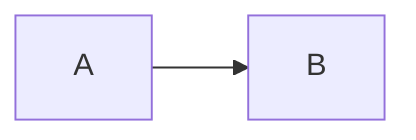
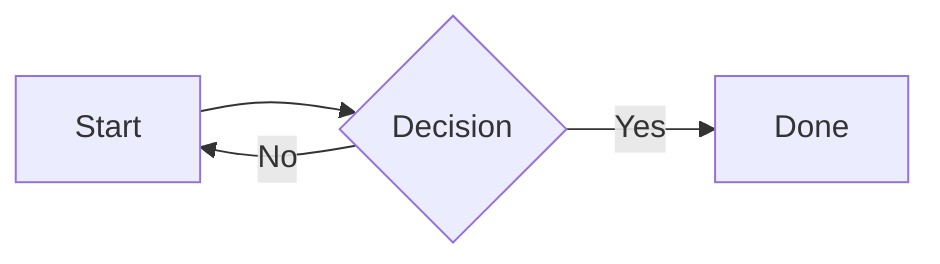
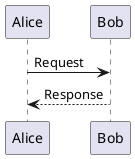

# Diagram Support Implementation Plan

> **For agentic workers:** REQUIRED SUB-SKILL: Use superpowers:subagent-driven-development (recommended) or superpowers:executing-plans to implement this plan task-by-task. Steps use checkbox (`- [ ]`) syntax for tracking.

**Goal:** Add Mermaid and PlantUML diagram support to the Jekyll blog, both rendered to inline SVG at build time with no client-side JS or CDN dependencies.

**Architecture:** A Jekyll `:post_render` hook (`_plugins/diagram_renderer.rb`) scans each page's rendered HTML for fenced code blocks tagged `mermaid` or `plantuml`, pipes the source through the appropriate CLI tool, and replaces the code block with the resulting inline SVG. Mermaid uses `mmdc` (Node CLI); PlantUML uses `plantuml.jar` via Java. Both are installed in GitHub Actions before `jekyll build`.

**Tech Stack:** Ruby (Jekyll plugin + minitest), `@mermaid-js/mermaid-cli` (Node), `plantuml.jar` (Java 17), Jekyll 4.3, kramdown+rouge (existing).

---

## File Map

| File | Action | Purpose |
|------|--------|---------|
| `_plugins/diagram_renderer.rb` | Create | Jekyll hook + `DiagramRenderer` module with testable methods |
| `test/test_diagram_renderer.rb` | Create | Minitest unit tests for the module |
| `Gemfile` | Modify | Add `minitest` to `:test` group |
| `assets/css/theme-en.css` | Modify | Add `.diagram` and `.diagram-label` styles |
| `assets/css/theme-ko.css` | Modify | Same `.diagram` styles as EN |
| `.github/workflows/deploy.yml` | Modify | Add Java, PlantUML JAR, Node + mmdc setup before build |

---

## Task 1: Add diagram CSS to both theme files

**Files:**
- Modify: `assets/css/theme-en.css`
- Modify: `assets/css/theme-ko.css`

- [ ] **Step 1: Add `.diagram` styles to `theme-en.css`**

Append to the end of `assets/css/theme-en.css`, before the `@media` block:

```css
/* ── Diagrams ── */
.post-content .diagram {
  margin: 1.8em 0;
  text-align: center;
  background: #fafafa;
  border: 1px solid var(--border);
  border-radius: 8px;
  padding: 28px 20px;
  overflow-x: auto;
}

.post-content .diagram svg {
  max-width: 100%;
  height: auto;
}

.post-content .diagram-label {
  font-size: 11px;
  color: #bbb;
  font-family: var(--font-mono);
  margin-top: 10px;
  letter-spacing: 0.5px;
}
```

- [ ] **Step 2: Add the same block to `theme-ko.css`**

Append the exact same CSS block (from Step 1) to `assets/css/theme-ko.css`, before that file's `@media` block.

- [ ] **Step 3: Commit**

```bash
git add assets/css/theme-en.css assets/css/theme-ko.css
git commit -m "style: add .diagram wrapper styles for rendered diagrams"
```

---

## Task 2: Create the diagram renderer plugin with tests

**Files:**
- Create: `test/test_diagram_renderer.rb`
- Create: `_plugins/diagram_renderer.rb`
- Modify: `Gemfile`

### Context

Kramdown + Rouge turns a fenced code block like:

````markdown

````

into this HTML (exact structure, used by the regex):

```html
<div class="language-mermaid highlighter-rouge"><div class="highlight"><pre class="highlight"><code>flowchart LR
  A --&gt; B
</code></pre></div></div>
```

Note: `>` is HTML-encoded as `&gt;` inside `<code>`. The plugin must decode HTML entities before passing source to the renderer.

The plugin uses `DiagramRenderer.process(html)` — a pure module method — so it can be tested without a running Jekyll instance.

### Steps

- [ ] **Step 1: Add minitest to Gemfile**

In `Gemfile`, add a test group after the existing `group :jekyll_plugins` block:

```ruby
group :test do
  gem "minitest", "~> 5.0"
end
```

Run `bundle install` to update `Gemfile.lock`:

```bash
bundle install
```

- [ ] **Step 2: Create the test file with failing tests**

Create `test/test_diagram_renderer.rb`:

```ruby
# test/test_diagram_renderer.rb
require 'minitest/autorun'
require 'cgi'

# Load plugin without triggering Jekyll::Hooks (not available in test env)
module Jekyll
  module Hooks
    def self.register(*); end
  end
  module Logger
    def self.warn(*); end
  end
end

require_relative '../_plugins/diagram_renderer'

MERMAID_HTML = <<~HTML
  <div class="language-mermaid highlighter-rouge"><div class="highlight"><pre class="highlight"><code>flowchart LR
    A --&gt; B
  </code></pre></div></div>
HTML

PLANTUML_HTML = <<~HTML
  <div class="language-plantuml highlighter-rouge"><div class="highlight"><pre class="highlight"><code>@startuml
  Alice -&gt; Bob: Hello
  @enduml
  </code></pre></div></div>
HTML

FAKE_SVG = '<svg xmlns="http://www.w3.org/2000/svg" viewBox="0 0 100 50"><text x="10" y="25">diagram</text></svg>'

class TestDiagramRenderer < Minitest::Test
  # --- wrap ---

  def test_wrap_produces_diagram_div_with_label
    result = DiagramRenderer.wrap(FAKE_SVG, 'mermaid')
    assert_includes result, '<div class="diagram">'
    assert_includes result, FAKE_SVG
    assert_includes result, '<p class="diagram-label">mermaid</p>'
  end

  def test_wrap_strips_xml_declaration
    svg_with_xml_decl = %Q(<?xml version="1.0" encoding="utf-8"?>\n#{FAKE_SVG})
    result = DiagramRenderer.wrap(svg_with_xml_decl, 'plantuml')
    refute_includes result, '<?xml'
    assert_includes result, '<svg'
  end

  # --- process with mocked renderers ---

  def test_process_replaces_mermaid_block
    DiagramRenderer.stub(:render_mermaid, FAKE_SVG) do
      result = DiagramRenderer.process(MERMAID_HTML)
      assert_includes result, '<div class="diagram">'
      assert_includes result, FAKE_SVG
      assert_includes result, '<p class="diagram-label">mermaid</p>'
      refute_includes result, 'highlighter-rouge'
    end
  end

  def test_process_replaces_plantuml_block
    DiagramRenderer.stub(:render_plantuml, FAKE_SVG) do
      result = DiagramRenderer.process(PLANTUML_HTML)
      assert_includes result, '<div class="diagram">'
      assert_includes result, FAKE_SVG
      assert_includes result, '<p class="diagram-label">plantuml</p>'
      refute_includes result, 'highlighter-rouge'
    end
  end

  def test_process_leaves_non_diagram_html_unchanged
    html = '<p>Hello world</p>'
    assert_equal html, DiagramRenderer.process(html)
  end

  def test_process_decodes_html_entities_before_rendering
    captured = nil
    stubbed = ->(source) { captured = source; FAKE_SVG }
    DiagramRenderer.stub(:render_mermaid, stubbed) do
      DiagramRenderer.process(MERMAID_HTML)
    end
    assert_includes captured, 'A --> B'
    refute_includes captured, '&gt;'
  end

  # --- graceful fallback ---

  def test_process_leaves_block_unchanged_when_render_returns_nil
    DiagramRenderer.stub(:render_mermaid, nil) do
      result = DiagramRenderer.process(MERMAID_HTML)
      assert_includes result, 'highlighter-rouge'
    end
  end
end
```

- [ ] **Step 3: Run tests to confirm they fail**

```bash
bundle exec ruby -Itest test/test_diagram_renderer.rb
```

Expected: errors like `uninitialized constant DiagramRenderer` — the plugin doesn't exist yet.

- [ ] **Step 4: Create the plugin**

Create `_plugins/diagram_renderer.rb`:

```ruby
# _plugins/diagram_renderer.rb
require 'cgi'
require 'open3'
require 'tempfile'

module DiagramRenderer
  # Matches the exact HTML structure kramdown+rouge produces for fenced code blocks.
  # The outer div class is "language-{type} highlighter-rouge".
  BLOCK_PATTERN = %r{
    <div\ class="language-(mermaid|plantuml)\ highlighter-rouge">
    <div\ class="highlight">
    <pre\ class="highlight"><code>(.*?)</code></pre>
    </div></div>
  }mx

  def self.process(html)
    html.gsub(BLOCK_PATTERN) do
      type   = Regexp.last_match(1)
      source = CGI.unescapeHTML(Regexp.last_match(2)).strip
      svg    = render(type, source)
      svg ? wrap(svg, type) : Regexp.last_match(0)
    end
  end

  def self.render(type, source)
    case type
    when 'mermaid'  then render_mermaid(source)
    when 'plantuml' then render_plantuml(source)
    end
  rescue StandardError => e
    warn "[DiagramRenderer] Failed to render #{type}: #{e.message}"
    nil
  end

  def self.render_mermaid(source)
    return nil unless tool_available?('mmdc')

    input  = Tempfile.new(['mermaid', '.mmd'])
    output = Tempfile.new(['mermaid', '.svg'])
    begin
      input.write(source)
      input.close
      output.close

      cmd = ['mmdc', '-i', input.path, '-o', output.path]
      _stdout, stderr, status = Open3.capture3(*cmd)
      unless status.success?
        warn "[DiagramRenderer] mmdc failed: #{stderr}"
        return nil
      end

      File.read(output.path)
    ensure
      input.unlink
      output.unlink
    end
  end

  def self.render_plantuml(source)
    jar = ENV.fetch('PLANTUML_JAR', File.join(Dir.pwd, 'plantuml.jar'))
    unless File.exist?(jar)
      warn "[DiagramRenderer] plantuml.jar not found at #{jar} (set PLANTUML_JAR env var to override)"
      return nil
    end

    svg, stderr, status = Open3.capture3('java', '-jar', jar, '-tsvg', '-pipe', stdin_data: source)
    unless status.success?
      warn "[DiagramRenderer] plantuml failed: #{stderr}"
      return nil
    end

    svg
  end

  def self.wrap(svg, type)
    svg = svg.sub(/\A\s*<\?xml[^>]*\?>\s*/m, '').strip
    %(<div class="diagram">#{svg}<p class="diagram-label">#{type}</p></div>)
  end

  def self.tool_available?(name)
    system("which #{name} > /dev/null 2>&1")
  end
end

Jekyll::Hooks.register [:pages, :posts], :post_render do |doc|
  next unless doc.output_ext == '.html'

  doc.output = DiagramRenderer.process(doc.output)
end
```

- [ ] **Step 5: Run tests and confirm they pass**

```bash
bundle exec ruby -Itest test/test_diagram_renderer.rb
```

Expected output:
```
Run options: --seed XXXX
# Running:
......
6 runs, 10 assertions, 0 failures, 0 errors, 0 skips
```

- [ ] **Step 6: Commit**

```bash
git add Gemfile Gemfile.lock _plugins/diagram_renderer.rb test/test_diagram_renderer.rb
git commit -m "feat: add build-time diagram renderer plugin for Mermaid and PlantUML"
```

---

## Task 3: Update GitHub Actions to install diagram tools

**Files:**
- Modify: `.github/workflows/deploy.yml`

- [ ] **Step 1: Add tool setup steps before the Build site step**

In `.github/workflows/deploy.yml`, replace the `build` job's steps section. Insert three new steps between `ruby/setup-ruby` and `Build site`:

```yaml
jobs:
  build:
    runs-on: ubuntu-latest
    env:
      JEKYLL_ENV: production
    steps:
      - uses: actions/checkout@v4
        with:
          fetch-depth: 0

      - uses: ruby/setup-ruby@v1
        with:
          ruby-version: '3.2'
          bundler-cache: true

      - name: Set up Java
        uses: actions/setup-java@v4
        with:
          distribution: temurin
          java-version: '17'

      - name: Download PlantUML JAR
        run: |
          curl -sSL \
            https://github.com/plantuml/plantuml/releases/latest/download/plantuml.jar \
            -o plantuml.jar

      - name: Set up Node
        uses: actions/setup-node@v4
        with:
          node-version: 'lts/*'

      - name: Install Mermaid CLI
        run: npm install -g @mermaid-js/mermaid-cli

      - name: Build site
        run: bundle exec jekyll build

      - name: Upload artifact
        uses: actions/upload-pages-artifact@v3
```

> **Note on Mermaid CLI + Chromium:** `mmdc` uses Puppeteer (headless Chrome) internally. If the CI build fails with a Chrome sandbox error, add this step before *Install Mermaid CLI*:
> ```yaml
> - name: Install Chromium deps
>   run: sudo apt-get install -y libgbm-dev
> ```
> And pass `--puppeteerConfig '{"args":["--no-sandbox"]}'` to `mmdc` in the plugin's `render_mermaid` method.

- [ ] **Step 2: Commit**

```bash
git add .github/workflows/deploy.yml
git commit -m "ci: install Java, PlantUML JAR, and Mermaid CLI for build-time diagram rendering"
```

---

## Task 4: Smoke test end-to-end

- [ ] **Step 1: Create a test draft post**

Create `_drafts/test-diagrams.md`:

```markdown
---
layout: post-en
title: "Diagram Test"
date: 2026-04-01
---

## Mermaid



## PlantUML


```

- [ ] **Step 2: Build locally with drafts (requires mmdc + plantuml.jar)**

```bash
bundle exec jekyll build --drafts
```

Expected: build completes, no `[DiagramRenderer]` warnings in output.

- [ ] **Step 3: Verify SVG is in the output**

```bash
grep -c 'class="diagram"' _site/test-diagrams/index.html
```

Expected: `2` (one per diagram block).

- [ ] **Step 4: Delete the draft and commit nothing**

```bash
rm _drafts/test-diagrams.md
```

The draft was only for local verification — do not commit it.
