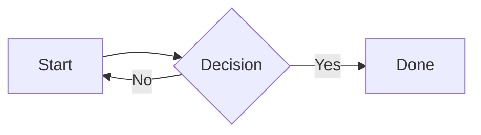
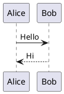

# Diagram Support Design

**Date:** 2026-04-01
**Status:** Approved

## Overview

Add Mermaid and PlantUML diagram support to the Jekyll blog. Both libraries render at **build time** — output is inline SVG baked into the static HTML. No JavaScript, no CDN, no external requests at page load.

Authors write standard fenced code blocks in Markdown:

````markdown

````

````markdown

````

## Architecture

### Approach: Two build-time pipelines

| Library  | Tool             | How                                      |
|----------|------------------|------------------------------------------|
| Mermaid  | `mmdc` (Node.js) | Pipe source via stdin → receive SVG      |
| PlantUML | `plantuml.jar` (Java) | Pipe source via stdin with `-tsvg -pipe` flag → receive SVG |

### Files changed

| File | Change |
|------|--------|
| `_plugins/diagram_renderer.rb` | **New.** Jekyll `:post_render` hook. Finds diagram code blocks in rendered HTML and replaces them with inline SVG. |
| `assets/css/theme-en.css` | **Modify.** Add `.diagram` and `.diagram-label` styles. |
| `assets/css/theme-ko.css` | **Modify.** Same `.diagram` styles as EN. |
| `.github/workflows/deploy.yml` | **Modify.** Add Java, PlantUML JAR download, and Node + mmdc setup steps before the build step. |

## Plugin Design (`_plugins/diagram_renderer.rb`)

Registers a Jekyll `:pages, :post_render` hook (runs for both posts and pages after kramdown renders Markdown to HTML).

**Processing steps:**

1. Kramdown turns fenced code blocks into:
   ```html
   <div class="language-mermaid highlighter-rouge">
     <div class="highlight">
       <pre class="highlight"><code>...source...</code></pre>
     </div>
   </div>
   ```
2. The plugin scans the output HTML with a regex for `language-mermaid` and `language-plantuml` wrapper divs.
3. Extracts the plain-text diagram source from inside `<code>...</code>`.
4. Calls the appropriate renderer:
   - **Mermaid:** `echo "<source>" | mmdc -i /dev/stdin -o /dev/stdout -e svg`
   - **PlantUML:** `echo "<source>" | java -jar plantuml.jar -tsvg -pipe`
5. Wraps the returned SVG in `<div class="diagram"><svg>...</svg><p class="diagram-label">mermaid</p></div>`.
6. Replaces the original code block div with the diagram wrapper.

**Graceful fallback:** If `mmdc` or `java` is not found on PATH, the plugin logs a warning and leaves the code block unchanged. This allows local development without the tools installed.

## CSS additions

Same rules added to both `theme-en.css` and `theme-ko.css` inside the `.post-content` scope:

```css
.post-content .diagram {
  margin: 1.8em 0;
  text-align: center;
  background: #fafafa;
  border: 1px solid var(--border);
  border-radius: 8px;
  padding: 28px 20px;
  overflow-x: auto;
}

.post-content .diagram svg {
  max-width: 100%;
  height: auto;
}

.post-content .diagram-label {
  font-size: 11px;
  color: #bbb;
  font-family: var(--font-mono);
  margin-top: 10px;
  letter-spacing: 0.5px;
}
```

## GitHub Actions changes (`.github/workflows/deploy.yml`)

Three steps inserted before the existing `Build site` step:

```yaml
- name: Set up Java
  uses: actions/setup-java@v4
  with:
    distribution: temurin
    java-version: '17'

- name: Download PlantUML JAR
  run: |
    curl -sSL https://github.com/plantuml/plantuml/releases/latest/download/plantuml.jar \
      -o plantuml.jar

- name: Set up Node and Mermaid CLI
  uses: actions/setup-node@v4
  with:
    node-version: 'lts/*'
- run: npm install -g @mermaid-js/mermaid-cli
```

> **Note:** `@mermaid-js/mermaid-cli` uses Puppeteer (headless Chromium) internally. GitHub Actions `ubuntu-latest` includes all required system libraries — no additional `apt-get` steps needed.

## Local development

Diagrams are optional at local dev time. If `mmdc` or `java` is missing, the plugin leaves fenced blocks as styled code — readable but not rendered as diagrams.

To render locally, install:
```bash
npm install -g @mermaid-js/mermaid-cli
# Download plantuml.jar to repo root
curl -sSL https://github.com/plantuml/plantuml/releases/latest/download/plantuml.jar -o plantuml.jar
```

## Out of scope

- Dark mode diagram theming
- Diagram caching between builds (acceptable build time impact for a personal blog)
- Support for other diagram formats (D2, Graphviz, etc.)
